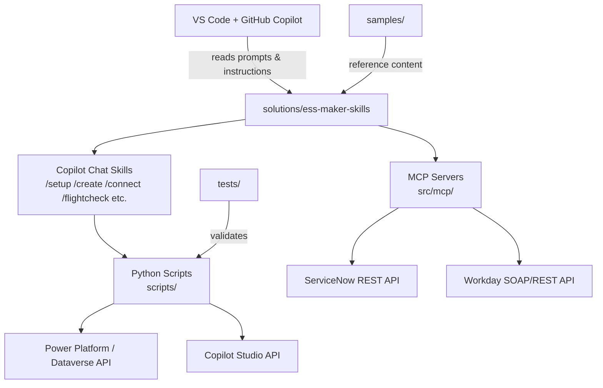

# Employee Self-Service Agent Developer Kit

A monorepo of solutions, samples, and tooling for the Microsoft Employee Self-Service (ESS) agent built on Microsoft Copilot Studio.

> **This repo is intended as an example or learning tool.** It is not a Microsoft product or a supported service. See [SUPPORT.md](SUPPORT.md) for the support model and [SECURITY.md](SECURITY.md) for reporting security issues.

## Getting started

This repo is a **monorepo of solutions** under [`solutions/`](solutions/). Each solution is a self-contained tool with its own purpose, dependencies, and instructions.

### Pick your setup path

There are several ways to set up your environment depending on your needs:

| Option | Best for | Guide |
|--------|----------|-------|
| **One-shot installer** (Windows) | Full maker kit — installs VS Code, Python, Git, and all dependencies | [Setup README](setup/README.md) |
| **One-shot installer** (macOS) | Same as above, using Homebrew | [Setup README](setup/README.md) |
| **GitHub Codespaces** | Browser-based development — no local install required ([free tier available](https://docs.github.com/en/billing/managing-billing-for-your-products/managing-billing-for-github-codespaces/about-billing-for-github-codespaces#monthly-included-storage-and-core-hours-for-personal-accounts)) | [Setup README](setup/README.md#github-codespaces-no-local-install) |
| **FlightCheck only** | Pre-deployment validation without the full ADK install | [Setup README](setup/README.md#flightcheck-only-mode) |
| **Manual setup** | Clone or download the repo and open it in VS Code yourself | [Maker Kit README](solutions/ess-maker-skills/README.md#quick-start) — see also the [step-by-step walkthrough below](#how-to-open-ess-maker-skills-as-a-workspace-no-terminal-needed) |

> **GitHub Copilot subscription is required** for the in-editor maker experience.

### ⚠️ Important: open the right folder in VS Code

The kit's slash-commands (`/setup`, `/flightcheck`, etc.) **only appear when you open a specific solution folder as your VS Code workspace** — not the top-level repo folder. If you open the wrong folder, Copilot Chat will not know about the kit and `/setup` will do nothing.

> The **one-shot installer** and **GitHub Codespaces** paths above open the correct folder for you automatically. The walkthrough below is for the **Manual setup** path.

### How to open `ess-maker-skills` as a workspace (no terminal needed)

1. **Get the code.**
   On the GitHub page, click the green **`< > Code`** button → **`Download ZIP`**. Unzip the file somewhere on your computer (for example, `Documents\Employee-Self-Service-Agent-Developer-Kit`). *(Or, if you already use Git, clone the repo with your tool of choice — GitHub Desktop, Visual Studio, etc.)*

2. **Open VS Code.**

3. **Click `File` → `Open Folder…`** (keyboard shortcut: `Ctrl+K Ctrl+O`).

4. **Navigate INSIDE the unzipped folder, then INTO `solutions`, and select `ess-maker-skills`.**

   The full path you select should look like:
   ```
   Employee-Self-Service-Agent-Developer-Kit\solutions\ess-maker-skills
   ```

   ✅ **Correct** — pick this:
   ```
   Employee-Self-Service-Agent-Developer-Kit\
     solutions\
       ess-maker-skills\    ← select this folder, then click "Select Folder"
   ```

   ❌ **Wrong** — do NOT pick the top-level folder:
   ```
   Employee-Self-Service-Agent-Developer-Kit\    ← do NOT pick this
   ```

5. **Click `Select Folder`.** VS Code will open with `ess-maker-skills` as your workspace root.

6. **Open Copilot Chat.** Click the chat icon in the left sidebar (or press `Ctrl+Alt+I`).

7. **Type `/setup`** and press Enter. The kit will guide you from there.

### "I opened the wrong folder — now what?"

If you typed `/setup` and nothing happened, you probably opened the top-level repo folder. Check the file Explorer in VS Code's left sidebar:

- If you see `solutions`, `samples`, `LICENSE`, `CONTRIBUTING.md` — **you're at the wrong level.**
- If you see `.github`, `scripts`, `src`, `workspace` — **you're in the right place.**

To fix it: `File` → `Open Folder...` again, this time double-click into `solutions`, click on `ess-maker-skills` once to select it, then click `Select Folder`.

## Solutions

| Folder | What it does | How to use |
|---|---|---|
| [`solutions/ess-maker-skills/`](solutions/ess-maker-skills/) | Customize your ESS agent using GitHub Copilot in VS Code — no deep platform knowledge required. | Open the folder in VS Code, then type `/setup` in Copilot Chat. |
| `solutions/ess-flightcheck/` *(planned — see [#69](https://github.com/microsoft/Employee-Self-Service-Agent-Developer-Kit/issues/69))* | Validate your ESS deployment readiness. Runs licensing, identity, integration, and configuration checks against your live environment. | Open the folder in VS Code and type `/flightcheck` in Copilot Chat — or run `python cli.py --scope full` standalone (no LLM needed). |

Additional solutions will be added under `solutions/` over time.

## Samples

Reference content used directly by customers — topic YAMLs, template-config XMLs, evaluation test sets, and integration walkthroughs — lives at the root under [`samples/`](samples/), peer to `solutions/`. Samples are first-class reference resources, not implementation details of any single solution.

## Architecture

This project follows a **monorepo** layout where each solution is self-contained and the repo root provides shared infrastructure (CI, testing, samples).



**Key components:**

| Component | Location | Role |
|-----------|----------|------|
| **Copilot Chat Skills** | `solutions/ess-maker-skills/src/skills/` | Prompt-based slash-commands (`/setup`, `/create`, `/connect`, `/flightcheck`, etc.) that GitHub Copilot interprets to guide the maker experience |
| **Python Scripts** | `solutions/ess-maker-skills/scripts/` | CLI automation backing the skills — authentication (MSAL), topic extraction, push to Dataverse, flightcheck validation, evaluation runs |
| **MCP Servers** | `solutions/ess-maker-skills/src/mcp/` | Model Context Protocol servers for ServiceNow, Workday, and ADK integrations providing tool surfaces to Copilot |
| **Samples** | `samples/` | Reference topic YAMLs, template-config XMLs, evaluation test sets, and integration walkthroughs for Facilities, ServiceNow, and Workday scenarios |
| **Tests** | `tests/` | Pytest suite using VCR.py cassettes for replay-based testing of scripts and MCP code |
| **Setup Installer** | `setup/` | One-shot install scripts (Windows/macOS) that provision VS Code, Python, Git, and dependencies |
| **CI/CD** | `.github/workflows/` | Linting (`ruff`), CodeQL security scanning, sample validation, label sync |

**Prerequisites:** Python ≥ 3.11, VS Code with GitHub Copilot extension, a Microsoft 365 / Power Platform tenant with Copilot Studio access.

## Repository structure

```
.github/                Repo-level CI, CodeQL, Dependabot, issue templates, labels
solutions/
  ess-maker-skills/     Maker kit — customize your ESS agent in VS Code with Copilot
  ess-flightcheck/      (planned) Standalone deployment-readiness validator
samples/                Reference topics, template configs, evaluation test sets (peer to solutions/)
setup/                  One-shot installer scripts for Windows and macOS
tests/                  Pytest test suite (VCR cassettes, mocks, fixtures)
tools/                  Dev tooling (sample validation, maker profile utilities)
LICENSE                 MIT
SECURITY.md             Microsoft MSRC reporting path
CODE_OF_CONDUCT.md      Microsoft Open Source Code of Conduct
CONTRIBUTING.md         Contribution guide, maintenance, privacy posture, validation
SUPPORT.md              Support model
```

## Telemetry

The ESS Maker Skills CLI collects pseudonymous usage telemetry (enabled by
default) to help improve the product. No developer identity, agent content, or
personal data is collected. See
[Telemetry & Privacy](solutions/ess-maker-skills/README.md#telemetry--privacy)
for what's collected and how to opt out.

## Contributing

This project welcomes contributions and suggestions. Most contributions require you to agree to a Contributor License Agreement (CLA) declaring that you have the right to, and actually do, grant us the rights to use your contribution. For details, visit https://cla.microsoft.com.

Please read our [Contributing Guide](CONTRIBUTING.md) for the full contribution model, security maintenance commitments, scope management policy, privacy posture, and validation guide.

### Pull request process

1. **Fork and branch** — create a feature branch from `main`.
2. **Lint locally** — run `ruff check` and `python -m compileall` on changed files (see [Validating your changes](CONTRIBUTING.md#validating-your-changes)).
3. **Test** — run `pytest` from the repo root if your change touches Python scripts or MCP servers.
4. **Open a PR** — keep changes minimal and surgical. The CLA bot will prompt external contributors to sign.
5. **CI checks** — CI runs linting, CodeQL, and sample validation automatically. All checks must pass.
6. **Review** — a maintainer will review your PR. Address feedback and keep commits clean.
7. **Merge** — once approved and CI is green, a maintainer will merge via squash merge.

## License

This project is licensed under the [MIT License](LICENSE).

## Trademarks

This project may contain trademarks or logos for projects, products, or services. Authorized use of Microsoft trademarks or logos is subject to and must follow [Microsoft's Trademark & Brand Guidelines](https://www.microsoft.com/en-us/legal/intellectualproperty/trademarks/usage/general). Use of Microsoft trademarks or logos in modified versions of this project must not cause confusion or imply Microsoft sponsorship. Any use of third-party trademarks or logos are subject to those third-party's policies.
