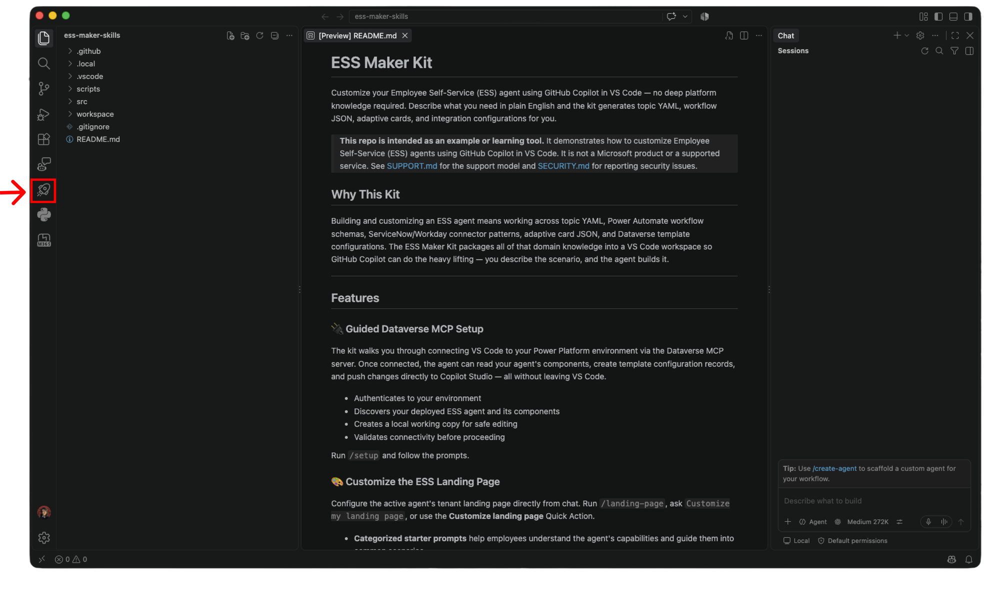
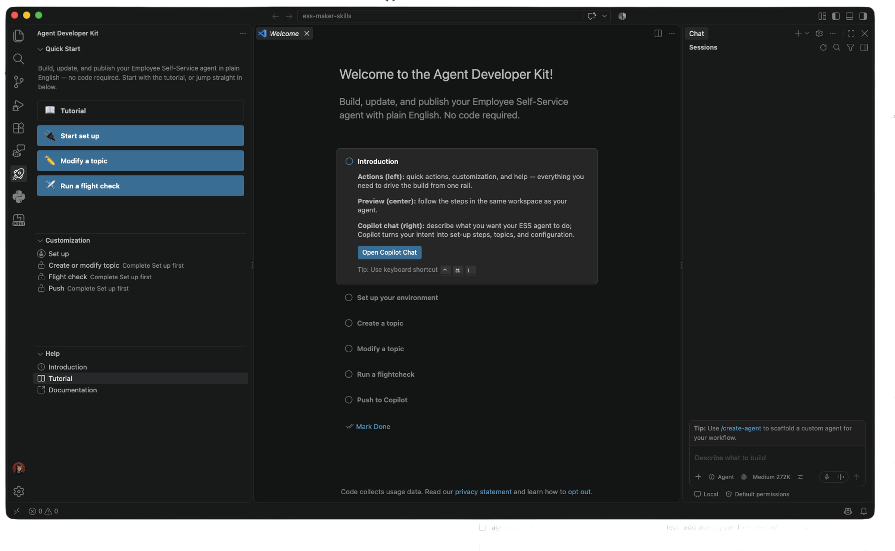

# Employee Self-Service Agent Developer Kit

A monorepo of solutions, samples, and tooling for the Microsoft Employee Self-Service (ESS) agent built on Microsoft Copilot Studio.

> **This repo is intended as an example or learning tool.** It is not a Microsoft product or a supported service. See [SUPPORT.md](SUPPORT.md) for the support model and [SECURITY.md](SECURITY.md) for reporting security issues.

## Getting started

Run the one-shot installer for your platform. It installs everything needed for the ESS Maker Kit (VS Code, Python, Git, GitHub CLI, Copilot extensions, and dependencies), clones the repo, opens VS Code at `solutions/ess-maker-skills/`, and starts `/setup` in Copilot Chat.

**Windows** (PowerShell):

```powershell
iex (irm https://raw.githubusercontent.com/microsoft/Employee-Self-Service-Agent-Developer-Kit/main/setup/bootstrap.ps1)
```

**macOS** (Terminal):

```bash
/bin/bash -c "$(curl -fsSL https://raw.githubusercontent.com/microsoft/Employee-Self-Service-Agent-Developer-Kit/main/setup/bootstrap-mac.sh)"
```

> **GitHub Copilot subscription is required** for the in-editor maker experience.

Other setup paths — Lite Mode (chat-first layout), GitHub Codespaces, FlightCheck-only, and manual install — are documented in the [Setup README](setup/README.md).

For more info on the available solutions, samples, repository structure, and telemetry, see [MORE_INFO.md](MORE_INFO.md).

## New to VS Code?

The installer opens VS Code for you. If this is your first time in VS Code, use the guided view for a friendlier way to navigate the kit. In the **activity bar** along the far-left edge of the window, click the **rocket icon**.



That opens a simple, point-and-click view of the kit — a **Quick start** panel, a **Customization** list of every skill, and a **Help** tab. To begin, open the **Help** tab and click **Tutorial** for a step-by-step walkthrough.



Prefer to drive everything from chat? You can ignore the rocket view entirely and just type commands like `/setup` into Copilot Chat.

## Contributing

This project welcomes contributions and suggestions. Most contributions require you to agree to a Contributor License Agreement (CLA) declaring that you have the right to, and actually do, grant us the rights to use your contribution. For details, visit https://cla.microsoft.com.

Please read our [Contributing Guide](CONTRIBUTING.md) for the full contribution model, security maintenance commitments, scope management policy, privacy posture, and validation guide.

## License

This project is licensed under the [MIT License](LICENSE).

## Trademarks

This project may contain trademarks or logos for projects, products, or services. Authorized use of Microsoft trademarks or logos is subject to and must follow [Microsoft's Trademark & Brand Guidelines](https://www.microsoft.com/en-us/legal/intellectualproperty/trademarks/usage/general). Use of Microsoft trademarks or logos in modified versions of this project must not cause confusion or imply Microsoft sponsorship. Any use of third-party trademarks or logos are subject to those third-party's policies.
