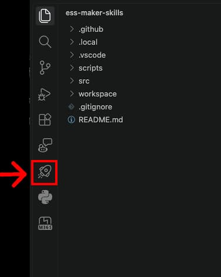

# Employee Self-Service Agent Developer Kit

A monorepo of solutions, samples, and tooling for the Microsoft Employee Self-Service (ESS) agent built on Microsoft Copilot Studio.

> **This repo is intended as an example or learning tool.** It is not a Microsoft product or a supported service. See [SUPPORT.md](SUPPORT.md) for the support model and [SECURITY.md](SECURITY.md) for reporting security issues.

## Getting started

One command installs everything (VS Code, Python 3.12, Git, GitHub CLI, .NET runtime, NuGet, Copilot extensions, pip dependencies) and opens `ess-maker-skills` in VS Code so `/setup` works out of the box.

**Windows** (PowerShell):

```powershell
iex (irm https://raw.githubusercontent.com/microsoft/Employee-Self-Service-Agent-Developer-Kit/main/setup/bootstrap.ps1)
```

**macOS** (Terminal):

```bash
/bin/bash -c "$(curl -fsSL https://raw.githubusercontent.com/microsoft/Employee-Self-Service-Agent-Developer-Kit/main/setup/bootstrap-mac.sh)"
```

See [`setup/README.md`](setup/README.md) for GitHub Codespaces, FlightCheck-only, and Maker vs Developer mode selection. Prefer to clone and open the repo yourself? See the [maker kit quick start](solutions/ess-maker-skills/README.md#quick-start). A **GitHub Copilot subscription is required** for the in-editor maker experience.

## New to VS Code?

The installer opens VS Code for you. If this is your first time in VS Code, use the guided view for a friendlier way to navigate the kit. In the **activity bar** along the far-left edge of the window, click the **rocket icon**.



That opens a simple, point-and-click view of the kit — a **Quick start** panel, a **Customization** list of every skill, and a **Help** tab. To begin, open the **Help** tab and click **Tutorial** for a step-by-step walkthrough.

Prefer to drive everything from chat? You can ignore the rocket view entirely and just type commands like `/setup` into Copilot Chat.

## Solutions

| Folder | What it does | How to use |
|---|---|---|
| [`solutions/ess-maker-skills/`](solutions/ess-maker-skills/) | Customize your ESS agent using GitHub Copilot in VS Code — no deep platform knowledge required. | Open the folder in VS Code, then type `/setup` in Copilot Chat. |
| `solutions/ess-flightcheck/` *(planned — see [#69](https://github.com/microsoft/Employee-Self-Service-Agent-Developer-Kit/issues/69))* | Validate your ESS deployment readiness. Runs licensing, identity, integration, and configuration checks against your live environment. | Open the folder in VS Code and type `/flightcheck` in Copilot Chat — or run `python cli.py --scope full` standalone (no LLM needed). |

Additional solutions will be added under `solutions/` over time.

For samples, repository structure, and telemetry details, see [REFERENCE.md](REFERENCE.md).

## Contributing

This project welcomes contributions and suggestions. Most contributions require you to agree to a Contributor License Agreement (CLA) declaring that you have the right to, and actually do, grant us the rights to use your contribution. For details, visit https://cla.microsoft.com.

Please read our [Contributing Guide](CONTRIBUTING.md) for the full contribution model, security maintenance commitments, scope management policy, privacy posture, and validation guide.

## License

This project is licensed under the [MIT License](LICENSE).

## Trademarks

This project may contain trademarks or logos for projects, products, or services. Authorized use of Microsoft trademarks or logos is subject to and must follow [Microsoft's Trademark & Brand Guidelines](https://www.microsoft.com/en-us/legal/intellectualproperty/trademarks/usage/general). Use of Microsoft trademarks or logos in modified versions of this project must not cause confusion or imply Microsoft sponsorship. Any use of third-party trademarks or logos are subject to those third-party's policies.
