# ADK `/planner` — Plan Generation, Role Assignment & Task Capture (Step 1)

How the ESS Agent Developer Kit turns a sponsor's intent into a structured, locally-stored **Plan** — grounded by *actively researching* Microsoft Learn — breaks it into atomic Tasks each **assigned to a role or a specific person**, lets a person discover the Tasks waiting on them, and keeps the Plan honest by capturing what each Task actually produced (starting with the environment `/setup` creates).

| | |
|---|---|
| **Status** | Draft for review |
| **Owner** | Harsheet Jain |
| **Audience** | ESS Agent Development Kit (ADK) engineers; WeveNova backend engineers (for the Step‑1 ↔ Step‑2 seam) |
| **Baseline** | `origin/main` of `Employee-Self-Service-Agent-Developer-Kit`, HEAD `72a24f8`. Everything described as "exists today" is verified on `main` (Appendix A). Feature‑branch code (`harsheetjain/env-discovery-inventory`, the `scripts/planner` commits) and locally‑generated runtime state are **not** ground truth. |
| **Companion** | *Plan Enrichment & Persistence* (Step 2) — the WeveNova‑side data‑modelling doc. This is Step 1 (the ADK side), written to produce exactly the shape Step 2 stores. Cross‑references are marked "Step‑2 §N" and track the **updated** Step‑2 draft (extended‑`Principal` assignment §7.4; single `Context` bag §7.1/§7.6; audit §15). |
| **Naming note** | The **command/skill** is **`/planner`** (renamed from `/plan`, which collides with VS Code's built‑in *Plan mode*). The **document it produces** is still called the **Plan** (`workspace/plan/plan.json`) — the noun matches the WeveNova `Plan` entity so the Step‑2 sync is a field copy, not a rename. In short: *the `/planner` skill authors a Plan.* |

---

## 1. Summary

A sponsor tells the ESS Maker Kit what they want — *"I want ESS to handle HR ticketing for employees, grounded in our Workday data."* Today the kit can `/connect` systems, `/create` topics, `/evaluate`, and `/flightcheck`, but it has **no notion of a plan**: nothing captures scenario intent, nothing sequences the work, nothing assigns it, and nothing remembers what a step produced.

Step 1 adds that missing brain: a new **`/planner` skill** that

1. **actively researches Microsoft Learn** — crawling the ESS documentation section via its Table of Contents (`toc.json`) — **and reads the tenant inventory in WeveNova (if present, include it; if empty, leave it)** to build a fresh, grounded picture of what ESS can do, what each scenario requires, and what already exists in the tenant (§7);
2. runs a short **grounded interview** to scope the rollout (§8);
3. emits a **Plan**: the sponsor's intent captured as a single open **Context bag**, plus a handful of **atomic Tasks** — *create an environment, connect Workday, author topics, generate evals* — each **assigned to a role and (optionally) a specific person** (§9, §10);
4. lets a person ask **"what am I assigned?"** and answers grouped by the roles they hold (§11); and
5. **captures what each Task produced** by reading the **tenant inventory** — a WeveNova artifact that stores facts about the tenant (fetched from the distinct controlled Dataverse APIs) — falling back to observing local kit state or asking the assignee, and pinning artifacts (the `/setup` → `environmentId` hand‑off is canonical) onto the Plan so a later Task reads them straight off it (§12).

Four ideas run through the design:

- **Learn is researched at planning time, not treated as a static cache.** The planner crawls the live Learn TOC every run; the kit's vendored doc snapshot is only a seed hint and an offline safety net (§7). *(This design was written after confirming the vendored ESS Learn URL has already moved — see §7.1 — which is exactly why live research is primary.)*
- **The Plan is a local‑first, structured document with the same shape WeveNova will store.** It lives on disk under `workspace/plan/plan.json`; Step 2 lifts that shape into WeveNova with no re‑modelling (§5, §9, §15).
- **Assignment is role‑first, person‑optional, both retained.** A Task carries one extended `Principal` that can name a role, a person, or a person *acting as* a role — the model Step‑2 §7.4 settled (§10).
- **The Plan is kept honest by reading reality, not by trusting narration.** A completing Task's real side effect is **read from the tenant inventory** (the WeveNova record of tenant facts, fetched from the distinct Dataverse APIs) — or observed from local kit state — and pinned, mirroring Step‑2 §7.3/§9 (§12).

Step 1 is the **greenfield** path — plan from intent — but it **reads and writes the tenant inventory** (WeveNova) when present: research reads it to detect an existing deployment (§7.8), and capture reads/writes it to fill produced values (§12). The *proactive* enrichment — pruning Tasks whose prerequisites already exist, and a standalone `/discover` crawl — is the later flow this doc keeps a clean seam for (§14) but does not build.

---

## 2. Goals & non‑goals

**Goals**

1. Add a **`/planner`** skill that generates a structured Plan from a sponsor's intent, grounded by **actively researching Microsoft Learn** (§7) and refined by a **bounded interview** (§8).
2. Represent the Plan as **atomic Tasks**, each described by a **title + description** (the description says how — which command to run, e.g. `/connect`, or a portal/manual step) and **assignable to a role, a person, or a person acting as a role** via one extended `Principal` (§9, §10).
3. Support **Flow 1 (assign at creation):** the Task's **role is grounded from the Learn docs** (not named by the sponsor), the ADK lists the people who hold it, the sponsor picks one, and the Task is assigned to that person with the role retained (§10).
4. Support **Flow 2 (discover my work):** a person asks what they're assigned and sees Tasks **grouped by each role they hold**, covering people with more than one role (§11).
5. **Capture Task outputs** for each key a Task declares in `produces` (those keys grounded from the Learn doc, §7.6): fill each value either by **observing kit state** (the `/setup` → `environmentId` hand‑off) **or by asking the assignee** to supply it (plus any extra info they give us) — and **pin** them onto the Plan for later Tasks to read (§12).
6. Store the Plan **locally, structured, readable**, in the **same shape** WeveNova stores (Step‑2 §7), so Step 2 is a sync (§9, §15).
7. Keep the ADK **decoupled** from WeveNova, tenant inventory, **and the roles source**: the local Plan is authoritative and works with all three absent; each is an optional, swappable seam (§13, §14).
8. Do all of this **additively**, reusing the kit's patterns — the `SKILL.md` + `.prompt.md` model, the `.local/config.json` gate, the `workspace/` working copy, the `checkpoint → … → push` pipeline, the todo‑list progress tool.

**Non‑goals**

- **The WeveNova persistence schema and MCP wiring** (owned by Step 2). This doc produces the shape and defines the client‑side sync seam (§15).
- **The standalone `/discover` crawl and proactive skip‑existing pruning** (a separate workstream, §14). The tenant‑inventory **read/write seam** used by research (§7.8) and capture (§12) *is* in scope; it is absent‑safe (local fallbacks).
- **Building the roles source.** The role catalogue and role‑membership directory are a separate workstream (Step‑2 §7.4, open #7). This doc defines the **narrow client contract** the planner calls and ships **absent‑safe** (§10.4, §14).
- **Provisioning code for environments.** Whether `/setup` creates or binds a Dataverse environment is infra; §12 only relies on `/setup` leaving a detectable signal (`config.json`), which it already does.
- **Runtime agent behaviour.** We define the Plan the kit authors, not how the deployed ESS agent answers employees.

---

## 3. Actors and the end‑to‑end flow

| Actor | Role on the Plan | What they do | What they touch |
|---|---|---|---|
| Sponsor / agent owner | Plan author (Plan Editor) | States intent, answers the interview, **picks the person** for each Task (the role is grounded from Learn, §7/§10) | The whole Plan |
| Power Platform / IT admin | Task assignee | Runs `/setup`; confirms the produced `environmentId` (§12) | Runs a Task; artifact lands on the Plan |
| Integration owner | Task assignee | Runs `/connect` for Workday/ServiceNow | Runs a Task; connection/app artifacts land on the Plan |
| Eval author | Task assignee | Runs `/evaluate`; **reads** the `environmentId` off the Plan | Reads the Plan; eval artifact lands on the Plan |
| *Any assignee* | Task discovery | Asks the ADK **"what am I assigned?"** → sees Tasks grouped by role (§11) | Reads the Plan / synced Tasks |

**Soft assumption, not a hard one.** For the MVP we assume the sponsor who authors the Plan *also holds Power Platform admin access*, so one person can both write the Plan and run the `/setup` Task. **This is a convenience, not a design constraint.** The Task is assigned via a `Principal` that carries the (Learn‑grounded) role (§10); whether the sponsor happens to hold it is incidental. A different admin can run the Task and the same capture happens (§12). Nothing in the schema assumes a single operator.

**The two things that must be true (mirrors Step‑2 §3):** a downstream Task reads a value an earlier Task produced *without re‑discovering it*, and every actor sees the *same* Plan document.

### 3.1 The end‑to‑end flow (sponsor · task assignee · tenant inventory)

The sponsor and the assignee never talk directly — they meet at **the Plan** and the **WeveNova tenant inventory**. The sponsor authors Tasks (each with `produces`/`consumes` + a Learn‑grounded role); the assignee, matched by role, does the work and the **scan populates the produced values** back onto the Plan; downstream Tasks consume those artifacts.

```mermaid
flowchart LR
  subgraph SPONSOR["Sponsor flow — author the plan"]
    direction TB
    A(["set up ESS for my team"]) --> R["1 · Research<br/>Learn TOC + WeveNova tenant inventory<br/>(if present include it, if empty leave it)"]
    R --> I["2 · Interview<br/>objective · scenarios · enabled scenarios · systems · goals"]
    I --> PV["Eager EVAL PREVIEW · render-only<br/>golden prompts by category · generates nothing"]
    PV --> M["3 · Model — atomic Tasks<br/>title + description + grounded role + produces/consumes"]
    M --> ASG["4 · Assign · Flow 1<br/>grounded role → pick person / pool to role"]
  end

  subgraph PLAN["The Plan — shared source of truth"]
    direction TB
    TASKS["Tasks + roles<br/>produces → consumes DAG"]
    OUT[("outputs[] · PlanArtifacts")]
    MD["ESS-scenario-plan.md<br/>editable · reconciled back"]
    TASKS -->|state| MD
    OUT -->|artifacts| MD
  end

  subgraph ASSIGNEE["Task-assignee flow — do + complete"]
    direction TB
    Q(["what am I assigned?"]) --> RO["Resolve role(s)"]
    RO --> LS["Role-gated tasks (assigned + open-to-role)"]
    LS --> CL["Claim"] --> BR["Task brief · enrich from Learn<br/>kit skill OR Learn walkthrough"]
    BR --> DO["Do the work — example: run /setup"]
    DO --> SU["/setup produces artifacts:<br/>environmentId · dataverseEndpoint · agent slug"]
    SU --> TG{"Completion: planner asks 'done?'<br/>OR assignee says 'done'"}
    TG --> DISC["Assignee runs /discover —<br/>gets tenant facts, calls WeveNova"]
    SC["Planner reads the WeveNova<br/>tenant inventory (a source)"] --> POP["Populate produces (value or presence-only)<br/>ask only the gaps"]
  end

  subgraph TENINV["Tenant inventory (WeveNova) — durable, cross-plan record of what exists"]
    direction TB
    WN["Inventory record<br/>per field: safe-to-read → value · else presence-only"]
  end

  DV[("Controlled Dataverse APIs — the source the inventory's facts are fetched from<br/>access enforced by Dataverse, NOT by us: 200 if caller has access · else 403")]

  ASG ==>|"① emit tasks: produces/consumes + role"| TASKS
  TASKS ==>|"② role-gated 'my tasks' (Flow 2)"| Q
  DV ==>|"⑥ /discover fetches facts from Dataverse (200/403, assignee's access)"| DISC
  DISC ==>|"⑦ /discover calls WeveNova → stores the inventory"| WN
  WN ==>|"⑧ planner reads the inventory — value if safe, else presence-only"| SC
  POP ==>|"③ pin values / presence as PlanArtifacts"| OUT
  OUT -.->|"inventoryRef"| WN
  OUT ==>|"④ consume: env id · connections · topics → unblock downstream"| TASKS
  MD ==>|"⑤ progress + artifacts shown back"| A
  WN ==>|"⑨ read during planning — research reads the inventory (present→include, empty→leave)"| R
  WN -.->|"open questions"| OQ
  OQ["Open questions — WeveNova inventory reads<br/>• Which fields does the inventory expose to the planner? (env id, connection / app ids, topic / eval ids, or just presence flags?)<br/>• What permission is required to read them — any authenticated planner, or a specific role / scope?"]
  style OQ fill:#fff7ed,stroke:#d97706,stroke-dasharray:4 3,color:#7c2d12;
```



**Information transfer (the numbered arrows).** ① the sponsor emits Tasks (`produces`/`consumes` + grounded role) → ② the Plan hands each assignee their role‑gated Tasks (Flow 2) → ③ on completion the produced facts are pinned as `PlanArtifact`s → ④ downstream Tasks consume them and unblock (back‑propagation) → ⑤ the updated Plan is shown back to the sponsor. For capture, the **tenant inventory (a WeveNova artifact that stores tenant facts) is the source the planner reads** — and it is populated by a skill, **not** by WeveNova reaching into Dataverse: ⑥ the assignee runs **`/discover`**, which **fetches the tenant facts from the distinct Dataverse APIs** (where **Dataverse**, not the ADK, enforces access — `200` if the caller has it, `403` if not); ⑦ `/discover` then **calls WeveNova** to store those facts in the tenant inventory; ⑧ the planner **reads the inventory**, which returns each fact's **value if safe for everyone, else presence‑only**. During **planning**, ⑨ the sponsor's research also **reads** the inventory (present→include, empty→leave). **Open questions (posed in the diagram):** *which fields* does the inventory expose to the planner, and *what permission* (if any) is required to read them?

---

## 4. What exists on `main` (the only baseline)

Verified on `origin/main` (Appendix A). The kit is a **Copilot Chat grounding workspace**, not a running service: "skills" are Markdown playbooks the chat agent reads and follows, backed by Python scripts for the deterministic parts.

- **Skill model.** Each capability is a `src/skills/<name>/SKILL.md` playbook (sometimes with `stepN.md` sub‑files and a `tasks.md` checklist), invoked by a `.github/prompts/<name>.prompt.md` slash command and routed from `.github/copilot-instructions.md`. Existing skills: `onboarding` (`/setup`), `connect`, `topics/*`, `workflows/*`, `evaluations/*`, `flightcheck`, `cleanup` (`/scan`), `troubleshoot`, `backup/restore-template-configs`. **There is no `/plan` or `/planner` skill on `main`** (`git grep` finds only a VS Code *Plan mode* tip in `menu.prompt.md`).
- **The gate + local state.** `.local/config.json` (written atomically by `scripts/setup.py`) records `setup:"complete"`, the active `agent`, the `agents[]` array, and `dataverseEndpoint`. The copilot‑instructions gate every action on this file existing. `workspace/agents/<slug>/` holds the local working copy of the deployed agent. On `main`, `workspace/` tracks only `agents/.gitkeep` and `onboarding/.gitkeep` — **no `plan/`, no `inventory/`.**
- **Grounding corpus.** `src/reference/ess-docs/` is a **vendored snapshot of MS Learn ESS docs** (snapshot dated 2026‑04‑29; `README.md` records the source URL + layout). `src/examples/ess-samples/` holds real topic/config samples.
- **The mutation pipeline.** Every change follows **Checkpoint → Local edit → Scan → Dry run → Push → Verify** (`scripts/checkpoint.py`, `scripts/push.py`). Local edits aren't live until pushed.
- **Environment awareness already exists.** `scripts/list_environments.py` and the `scripts/flightcheck/` package (`pp_admin_client.py`, `powerplatform_client.py`, `environment.py`, `licensing.py`, `graph_client.py`, …) can enumerate environments, read licensing, and probe connections. Step 1 **reuses** these.
- **Progress tracking.** Skills already drive "the todo list tool to track progress" (e.g. `evaluations/create`). `/planner` does the same.

### 4.1 What isn't on `main`, and how we treat it

An earlier branch prototyped a planner engine, a discovery package, and `workspace/plan|inventory/*.json`. **None is on `main`** — it was cleared so this design starts from the authoritative baseline. We treat it as *prior art*, never a dependency, and re‑derive the Plan shape from the durable Step‑2 contract.

---

## 5. Where Step 1 sits relative to Step 2 (and why local‑first)

```
        ┌──────────────────────  ADK  (this doc, Step 1)  ──────────────────────┐
Sponsor │  /planner  ─grounded interview─►  Plan (local, structured)             │
 intent │     ▲                                    │  workspace/plan/plan.json     │
        │     │ RESEARCH (primary)                 │  = same shape as WeveNova Plan │
        │  learn.microsoft.com  ──TOC crawl──►     │                               │
        │  src/reference/ess-docs (seed + offline) ▼                               │
        │                              Tasks (atomic; role/person via Principal)    │
        │  roles endpoint (unbuilt seam) ─holders/roles─► assign (Flow 1) / find (Flow 2)
        │  /setup ─binds env, records details─►  .local/config.json  ─ADK detects─► pin  │
        └────────────────────────────────────────┬──────────────────────────────────┘
                                                  │  best-effort sync (§15)
                                                  ▼
        ┌────────────────────  WeveNova  (companion, Step 2)  ────────────────────┐
        │  Project → Plan → Task  (JSON-on-record) + Outputs ledger + MCP tools     │
        └────────────────────────────────────────────────────────────────────────────┘
```

**Local‑first is deliberate.** The kit already runs off local files with cloud calls layered on top. The Plan follows the same discipline: **authoritative on disk**, works with WeveNova / inventory / the roles source absent, syncs opportunistically (§15). This mirrors Step‑2's own stance (Step‑2 §6.3, Option B): *put the derived value on the dependent record; sync/refresh deliberately; never tie a read to whether the remote is up.*

---

## 6. The `/planner` skill — shape and routing

Additive, following the existing skill pattern exactly:

- **`.github/prompts/planner.prompt.md`** — the `/planner` slash command.
- **`src/skills/planner/SKILL.md`** — the playbook, with sub‑files: `research.md` (the Learn crawl, §7), `interview.md` (§8), `model.md` (the Plan schema + writer rules, §9), `assign.md` (Flow 1, §10), `evaluate.md` (the eager eval **preview** — render‑only, §10.2), `mytasks.md` (Flow 2 + the Learn‑enriched task brief, §11), `edit.md` (the Markdown round‑trip, §9.5), and `capture.md` (§12).
- **Routing** — add a `/planner` row to `.github/copilot-instructions.md`'s skill‑routing table and to `menu.prompt.md`.
- **Gate** — like every skill, `/planner` first reads `.local/config.json`. But it is the **one skill allowed to precede setup**: on greenfield the environment doesn't exist yet, and the first Task the planner emits is usually "run `/setup`". So if `setup` isn't complete, `/planner` still runs.
- **Progress** — the skill drives the todo‑list tool for its phases (research → interview → draft → assign → **eval hand‑off** → capture).

`/planner` **orchestrates**; it never re‑implements `/setup`, `/connect`, etc. A Task's **description** says how it's done — *usually* run an existing kit command (running it is how the Task gets done), sometimes a manual/portal/external step with a grounded doc pointer (§10). This keeps `/planner` thin and every kit behaviour in one place — the discipline Step‑2 §13.2 applies to the MCP loopback.

---

## 7. Grounded research: the planner actively researches Microsoft Learn

The planner's first job, and a **primary planning activity — not a fallback**. It must reason from *what ESS actually supports today*, or it will invent scenarios the platform can't deliver and ask irrelevant questions. It does that by **crawling the live ESS Learn section**, guided by that section's Table of Contents.

### 7.1 Why live research, not the vendored cache

The kit vendored the ESS Learn docs (snapshot 2026‑04‑29). That snapshot **drifts**: verified while writing this doc, the section's old URL (`…/copilot/microsoft-365/employee-self-service`) now **404s and 301‑redirects** to a new path (`…/microsoft-365/copilot/employee-self-service`), and the live section contains pages the snapshot doesn't (`workday-simplified-setup`, `developer-kit-overview`, `facilities-*`). So the vendored docs are demoted to two supporting roles only:

- **A seed hint** — they tell the planner the section exists and roughly where.
- **An offline safety net** — if the web is unreachable, the planner grounds on the snapshot *for availability*, and says so.

Everything else is **live**. This is the correction to any "vendored‑first, web‑as‑fallback" reading: for the planner, **Learn is the primary corpus**; the snapshot is a fallback only for uptime, never for priority.

### 7.2 What a TOC is, and why it is the spine of the crawl

**TOC = Table of Contents.** Every Microsoft Learn section publishes a machine‑readable `toc.json` at its base — the same tree that renders as the left‑nav. It lists every page as nested nodes:

```jsonc
{ "items": [
  { "href": "overview", "toc_title": "Introduction to Employee Self-Service agent" },
  { "toc_title": "Integrate external systems", "children": [
      { "href": "servicenow", "toc_title": "Integrating ServiceNow",
        "children": [ { "href": "servicenow-hrsd-itsm", "toc_title": "ServiceNow HRSD and ITSM" }, … ] },
      { "toc_title": "Workday", "children": [
          { "href": "workday-simplified-setup", "toc_title": "Simplified Workday integration setup" }, … ] }
  ] }, … ] }
```

So the TOC **is** the parent/child/sibling graph, authoritative and complete, with real `href`s. The crawl fetches `toc.json` **first** and uses it as its spine — never guessing URLs, never scraping rendered nav. (The live ESS `toc.json` returns **59 pages**; §17 shows the real tree.)

### 7.3 Link taxonomy — how the planner classifies links

For any node (from the TOC, or a link found in a fetched page that resolves to a TOC `href`):

| Class | Identified by | Crawl action |
|---|---|---|
| **Child** | a node's `children[]` (e.g. `workday` → `workday-extensibility`, `workday-reports/*`) | drill in **iff the parent is relevant** to intent |
| **Sibling** | same‑level entries under one parent (`workday` ↔ `servicenow` ↔ `sapsuccessfactors`) | titles are free from the TOC; **fetch a sibling only if its title matches intent** |
| **Parent / breadcrumb** | the enclosing node / `metadata.breadcrumb_path` | used to locate the section base; not re‑fetched |
| **Related / in‑body** | markdown links inside a fetched page that **resolve to a known TOC href** (e.g. a Workday page → `prerequisites`) | follow if relevant + unvisited (catches cross‑section prerequisites) |
| **External** | non‑`learn.microsoft.com`, or outside the section base | **never auto‑followed**; captured as a reference only |

**Scope fence:** only `href`s present in this section's `toc.json` (or that resolve to one) are crawlable. This bounds the crawl to ESS *and* makes "no fabricated URLs" automatic — every fetched URL came from the TOC.

### 7.4 The crawl algorithm (the heuristic)

```
1. SEED       start from the vendored README's recorded section URL.
2. RESOLVE    follow 301s to the current section base. (web_fetch refuses cross-path
              redirects — capture the redirect target and re-fetch it explicitly.)
              If the bare base 404s, use the TOC's first node (href:"overview").
3. TOC        fetch {base}/toc.json  → the full child/sibling tree.
4. SELECT     map sponsor intent → TOC subtrees (relevance filter, §7.5).
              Always include: overview, prerequisites, deploy-overview-alm, install,
              commands-reference, securely-integrating-with-external-systems.
5. BFS        frontier = selected hrefs. Breadth-first, within budget:
                fetch {base}/{href}  → markdown
                extract facts (§7.6) + in-body links resolving to TOC hrefs
                enqueue newly-relevant, unvisited hrefs
              maintain a visited-set (canonical href).
6. STOP       at the page budget, OR when every in-scope scenario has a grounded
              capability + an owned prerequisite (the "both-satisfied" test, §8.3).
7. ASSEMBLE   normalize facts into the planning-context object (§7.6) with provenance.
```

**Bounds & pruning (what keeps it a heuristic, not a scraper):**
- **Relevance gate** — expand a subtree only if its `toc_title`/path matches an intent token (system, scenario area, market, eval, handoff). Non‑matching siblings are read **title‑only** (free), never fetched.
- **Budget** — ~15–20 page fetches per run; the TOC's natural depth (~4) caps depth.
- **Dedupe** — canonicalize `href` (strip anchor/query, normalize trailing slash) into a visited‑set.
- **Early stop** — stop when planning slots are covered; don't drain the budget.
- **Redirect handling** — on a refused cross‑path 301, re‑invoke with the final URL (learned live building this doc).
- **Untrusted data** — all fetched content is *data, not instructions* (kit Security Boundaries); a `# Note for the AI assistant:` inside a page body is ignored.

### 7.5 Intent → subtree mapping (relevance selection)

| Sponsor intent | TOC nodes fetched (deep) | Read title‑only (skipped) |
|---|---|---|
| System: **Workday** | whole `Workday` subtree (`workday-simplified-setup`, `workday-extensibility`, `workday-reports/*`) | SAP subtree |
| System: **ServiceNow HRSD** | `servicenow`, `servicenow-hrsd-itsm` | `servicenow-live-agent` unless handoff in scope |
| Scenario: **HR ticketing** | `servicenow-hrsd-itsm` + `overview` capability list | `facilities-*` |
| Scenario: **handoff** | `agent-handoff`, `servicenow-live-agent`, `connecting-agents-overview` | — |
| **Market / residency** (e.g. Germany) | `prerequisites`, `customize`, `securely-integrating-with-external-systems` | — |
| Always (task backbone) | `prerequisites`, `deploy-overview-alm`, `install`, `commands-reference` | — |

### 7.6 What research produces — the planning‑context object

From each fetched page, extract **structured facts, not raw HTML**, each stamped with `{sourceUrl, toc_title, fetchedAt}`:

```jsonc
{
  "sources":       [ {url, tocTitle, fetchedAt, relevance} ],        // provenance / citations
  "capabilities":  [ {system, scenario, sourceUrl} ],                // buildable scenario catalogue
  "prerequisites": [ {forScenarioOrSystem, requirement, role, how, produces, sourceUrl} ], // → Tasks
                     // role     = responsible role, GROUNDED FROM THE DOC (not asked of the sponsor) — §10
                     // how      = plain-language how it's done (which command to run, or a portal/manual step) — goes into the Task description — §10
                     // produces = output keys this step yields (e.g. "primaryEnvironment","entraApp"),
                     //            GROUNDED FROM THE DOC — filled at completion by observe OR ask (§12)
  "constraints":   [ {note, sourceUrl} ],                            // e.g. "Workday requires Entra SSO"; residency
  "openItems":     [ {question, why} ]                               // gaps Learn didn't answer → interview Qs
}
```

This maps 1:1 onto the Plan: `capabilities → Context (group scenarioContext)`, `prerequisites → Tasks (description + grounded role — both extracted from the docs, §10)`, `constraints → market/acceptance Context entries`, `openItems → interview questions`. Every derived entry carries `provenance.source = "Agent"` + the source URL. The planner **caches** this object (e.g. `workspace/plan/research-context.json`) so a session is deterministic and re‑runs are cheap; it re‑crawls on explicit refresh or when intent changes, and **diffs the live TOC against the vendored snapshot** to flag drift (live wins).

### 7.7 Determinism, not search‑for‑its‑own‑sake

Mirrors Step‑2 §7.7. The value of research is a **consistent** Plan for the same intent — the planner grounds on decided facts (this integration, these supported scenarios, this prerequisite) instead of re‑inferring and drifting. Research narrows; the interview decides; the Plan records. People/role facts are **never** sourced from web research — they come from the roles endpoint + Work IQ (§10.4).

### 7.8 The tenant inventory is another source (alongside Learn and Dataverse)

The planner grounds on **several sources**, reading from whichever are available: the **Learn links** (what ESS can do, §7.1–7.7), the **tenant inventory**, and the **Dataverse APIs** directly (if available). The **tenant inventory is a WeveNova artifact (we are implementing) that stores facts about the tenant** — an environment, a connection, an installed starter — and is **distinct from** the Dataverse APIs those facts are fetched from. It **acts as a source** the planner reads: **if the inventory is present (populated), include it; if it is empty (or absent), leave it and move on.** When present, it lets the planner detect **greenfield vs. an existing deployment** and pre‑fill known produced state instead of proposing Tasks for things that already exist; when empty — a first‑time tenant, or WeveNova unreachable — research falls back to Learn (and Dataverse if reachable) and the Plan is built from intent. Reading it is best‑effort and non‑blocking; **field visibility is the inventory's policy and access is Dataverse's (`200`/`403`), never the ADK's** (§12.1, §12.3).

---

## 8. The interview: what questions to ask

The planner asks the **fewest questions that let it commit a buildable, scoped, assigned Plan** — and both sides must be satisfied: the **sponsor** that it captures what they want, the **ADK** that every scenario is grounded, every prerequisite has a Task, and every Task has an owner.

### 8.1 Elicitation model — grounded slot‑filling

Model it as **slot‑filling**: the planner has slots it must fill to emit a Plan; research (§7) both proposes candidate values and decides which slots apply. Ask about a slot only when (a) it's required to scope, sequence, or assign work, and (b) research didn't already answer it. Principles: **propose, don't interrogate** (react to a grounded default); **batch by theme, one theme at a time**; **stop early**.

### 8.2 The slot / question bank

Intent answers become **`Context` entries** (§9.2), grouped:

| # | Question (grounded example) | Context `group` |
|---|---|---|
| 1 | "In one sentence — what should this agent do, and for whom?" | `objective` |
| 2 | "Which system holds the data for **{area}** — e.g. Workday, ServiceNow, SharePoint?" (ask per area) | `system` (scoped key `system.{area}`) |
| 3 | "From {system} I can support {grounded scenario list}. Which are in scope for wave 1?" | `scenarioContext` (area/jtbd) |
| 4 | "Employees only, or managers too?" | `scenarioContext` (persona) |
| 5 | "Rolling out to a specific market or wave first (e.g. Germany, pilot group)?" | `market` |
| 6 | "What business outcome measures success (e.g. deflect 30% of HR tickets)?" | `businessGoals` |
| 7 | "How will you know a scenario is done — pilot‑ready? production‑signed‑off?" | `acceptanceCriteria` |

**Assignment question (Flow 1, per Task — §10).** The planner does **not** ask the sponsor which role a Task needs — the **role is grounded from the Learn docs** during research (§7.6). The only assignment question is *who*:
- 9. *"{title} is a **{grounded role}** task. People with that role: {list from the roles endpoint}. Assign to whom — or leave it open to the {role} pool?"* → assign a person (role retained) or leave pooled.

Questions **1–3** are almost always asked; **4–7** as scope warrants; **9** runs per Task during the assignment pass. A typical greenfield interview is **4–6 intent turns + a quick per‑task assignment pass**.

### 8.3 The "both satisfied" stop condition

End the interview when:

- **Sponsor‑satisfied:** the sponsor accepted the scenario list + goals (an explicit *"looks right"*).
- **ADK‑satisfied:** every in‑scope scenario resolves to a grounded, supported capability; every scenario's prerequisites are represented by a Task; and **every Task is either assigned to a person or pooled to a role**. No scenario has an unmet, unowned prerequisite.

If ADK‑satisfied fails (an unsupported scenario, or a prerequisite nobody will own), the planner surfaces it rather than emitting an unbuildable Plan.

---

## 9. The local Plan model (structured, on disk)

*Where the "local structured" plan is stored, for now*, plus its shape. **The shape is Step‑2's model verbatim, so Step 2 is a sync (§15), not a re‑model.** Two Step‑2 updates are reflected here: **all intent folds into one `Context` bag** (Step‑2 §7.1/§7.6), and **assignment is one extended `Principal`** (Step‑2 §7.4).

### 9.1 Storage location and files (for now)

```
workspace/
  plan/
    plan.json               # the structured Plan — the source of truth
    ESS-scenario-plan.md    # editable human-readable render of plan.json (the "ESS scenario plan" a Plan editor revises; reconciled back)
    research-context.json   # cached Learn-research corpus (§7.6), regenerated on refresh
```

- `workspace/plan/plan.json` is the authoritative local Plan. `workspace/` is git‑ignored runtime state (like `workspace/agents/`), so the Plan is per‑maker and never accidentally committed. A `.gitkeep` seeds `workspace/plan/` on `main`.
- `ESS-scenario-plan.md` is the human view **and the editable surface**: scenarios, Tasks + assignees + state, pinned outputs. A Plan editor can revise it directly (or edit-and-re-upload) or just say what to change; the planner **reconciles** those edits back into `plan.json` through the CLI, asking where ambiguous (§9.5, `src/skills/planner/edit.md`). It regenerates from `plan.json` after every mutation, so a reconcile round-trips cleanly.
- **Writer discipline:** `plan.json` is written **atomically** (temp‑file + `os.replace`), exactly like `setup.py` writes `config.json`. A small `scripts/planner/` package owns read/write/validate; the skill never hand‑serialises JSON (mirrors the `scripts/flightcheck/` package layout).

### 9.2 The schema (aligned to the updated Step‑2 §7)

```jsonc
{
  "schemaVersion": 1,
  "planId": "",            // empty until synced to WeveNova (§15); locally the file is the id
  "projectId": "",
  "status": "Draft",       // Draft → Active → Completed (master lifecycle)

  // ── ALL sponsor/agent intent lives in ONE open Context bag (Step-2 §7.1/§7.6) ──
  // objective, businessGoals, scenario/system intent, market, acceptanceCriteria — all here.
  "context": [
    { "key": "objective", "value": "ESS HR ticketing for employees on Workday", "group": "objective",
      "description": "Plain-language goal the sponsor stated",
      "provenance": { "source": "User", "addedBy": {"type":"User","id":"<sponsor oid>"}, "addedAt": "…" } },
    { "key": "deflectTickets", "value": "Deflect 30% of HR tickets in 6 months", "group": "businessGoals",
      "description": "Primary business outcome", "provenance": { "source": "User", … } },
    { "key": "area", "value": "HR-Ticketing", "group": "scenarioContext",
      "description": "ESS scenario area", "provenance": { "source": "Agent", "addedBy": {"type":"Service","id":"planner"}, … } },
    { "key": "system.hr-ticketing", "value": "ServiceNow HRSD", "group": "system", "provenance": { "source": "User", … } },
    { "key": "market", "value": "DE", "group": "market",
      "description": "Market this rollout targets first",
      "provenance": { "source": "User", "addedBy": {"type":"User","id":"<sponsor>"}, "addedAt": "…",
                      "updatedBy": {"type":"User","id":"<pm>"}, "updatedAt": "…" } },   // creator + last editor
    { "key": "topTicketTypes", "value": "Resolve the top-10 HR ticket types end to end",
      "group": "acceptanceCriteria", "provenance": { "source": "User", … } }
  ],
  // Each ContextEntry: key + SCALAR value + group + description + typed provenance
  //   provenance = { source: User|Agent|Discovered, addedBy: Principal, addedAt, updatedBy?: Principal, updatedAt? }
  // Overwrite-in-place by key: a re-write preserves addedBy/addedAt, refreshes updatedBy/updatedAt.

  // ── Tasks: atomic; described by title + description; one extended Principal each (Step-2 §7.4) ──
  "tasks": [
    { "id": "T1", "title": "Run setup",
      "description": "Run /setup to onboard the ADK: connect the kit to the ESS agent already deployed in the environment and record its details into config.json. (Provisioning the environment + installing ESS is a portal/admin prerequisite on a brand-new tenant.)",
      "assignedTo": { "type": "User", "id": "<paul oid>",  // assigned to a PERSON…
                      "user": { "oid": "<paul oid>" },
                      "role": { "roleId": "power-platform-admin" } },  // …ACTING AS a Learn-grounded role
      "state": "NotStarted",                              // NotStarted → InProgress → Completed (+ reopen)
      "produces": ["primaryEnvironment"], "consumes": [] },

    { "id": "T2", "title": "Connect Workday",
      "description": "Run /connect to connect Workday to the ESS agent and follow its steps.",
      "assignedTo": { "type": "Role", "id": "integration-owner",     // OPEN TO A ROLE (pool) — nobody yet
                      "role": { "roleId": "integration-owner" } },
      "state": "NotStarted", "produces": ["workdayConnection","workdayEntraApp"], "consumes": ["primaryEnvironment"],
      // OPTIONAL read-back-only step display — the skill fills this at RUNTIME from its tasks.md (§10.1).
      // Not a sub-entity, not promoted, not the Task boundary; empty until the skill runs.
      "checklist": [ { "label": "Admin setup complete", "done": false },
                     { "label": "Connection verified",  "done": false } ] },

    { "id": "T3", "title": "Generate evals",
      "description": "Run /evaluate to generate the eval suite for the agent.",
      "assignedTo": { "type": "User", "id": "<ann oid>", "user": { "oid": "<ann oid>" },
                      "role": { "roleId": "eval-author" } },
      "state": "NotStarted", "produces": ["evalSuite"], "consumes": ["primaryEnvironment"] },

    { "id": "T4", "title": "Publish the agent",
      // NOT a kit command — a portal/admin step; the description points at the grounded Learn doc.
      "description": "In the Power Platform admin center, publish the agent. See https://learn.microsoft.com/…/employee-self-service/publish",
      "assignedTo": { "type": "Role", "id": "power-platform-admin", "role": { "roleId": "power-platform-admin" } },
      "state": "NotStarted", "produces": [], "consumes": ["primaryEnvironment"] }
  ],

  // ── The single artifact ledger — the "forked state" (Step-2 §7.3) ──
  "outputs": [
    // Populated by the capture loop (§12). Empty at mint. Keyed by key; supersede-on-rewrite.
    // { "key":"primaryEnvironment", "kind":"Environment",
    //   "attributes":{ "environmentId":"d3f1…", "environmentUrl":"https://…" },
    //   "inventoryRef":"Environment:d3f1…", "producedByTaskId":"T1",
    //   "provenance":{ "source":"Agent", "addedBy":{…}, "addedAt":"…" }, "state":"Active" }
  ]
}
```

**Extended `Principal` — the three assignment states (Step‑2 §7.4):**

Per Step‑2 §7.4, `Principal` = `{ Type, Id, DirectoryRef?, Role?:{roleId, directoryRef?}, User?:{oid, directoryRef?} }` — the `directoryRef` on the role/user ref is an optional Step‑2 field (reserved for Group/Role expansion), so it is set only when a roles source provides it.

| State | `assignedTo` shape | Meaning |
|---|---|---|
| **Pool** | `{ type:"Role", id:R, role:{roleId:R} }` | Open to every holder of R; no person yet |
| **Claimed** | `{ type:"User", id:P, user:{oid:P}, role:{roleId:R} }` | A holder of R picked it up; role retained |
| **Direct‑for‑role** *(Flow 1 result)* | `{ type:"User", id:P, user:{oid:P}, role:{roleId:R} }` | Sponsor assigned P directly; role retained |
| *(plain person)* | `{ type:"User", id:P, user:{oid:P} }` | No role |

**Field‑for‑field alignment with Step 2** (so the sync is mechanical):

| Local `plan.json` | WeveNova (Step‑2) | Note |
|---|---|---|
| `context[]` (ContextEntry) | `Plan.Context[]` (§7.1/§7.6) | Single open bag; scalar values; `group`; typed provenance. Absorbs objective/goals/scenario/market/acceptance. |
| `tasks[].assignedTo` (extended Principal) | `Task.AssignedTo` Principal (`Role`/`User`) (§7.4) | Three states above; `AssignedToRoleId`/`AssignedToType` promoted server‑side. |
| `tasks[].produces/consumes` | `Task.Produces/Consumes` (§7.2) | Keys, **grounded from the Learn doc (§7.6)**; each `produces` key is filled at completion by observe‑or‑ask (§12). Phase‑2 dependency wiring. |
| `outputs[]` (PlanArtifact) | `Plan.Outputs[]` (§7.3) | `key`, `kind`, `attributes` (pinned), `inventoryRef`, `producedByTaskId`, `provenance`, `state`. |
| `tasks[].checklist[]` *(optional)* | *(client‑only)* | Read‑back‑only step display, filled by the skill at runtime from its `tasks.md` (§10.1). Not a WeveNova entity/scalar; maps into the Task description or client metadata, or is dropped, on sync. |

The only ADK‑only field is the optional `task.checklist[]` (§10.1). **A Task is described by its `title` + `description` — the same fields the WeveNova `Task` entity already has — and nothing else conveys "what to do".** There is deliberately **no** `task.action` field: an execution‑hint field is not part of the WeveNova Task entity and would be **rejected on persist**, so the "how" (which command to run — `/setup`, `/connect`, `/evaluate` — or a portal/manual step with a Learn/portal link) lives in the **description**, in plain language. The Task's role and its `produces` keys are still **grounded from the Learn docs** during research (§7.6), not asked of the sponsor. The **setup task is identified by what it produces** (`primaryEnvironment`), not by any skill/action field; `checklist[]` is client display detail that maps into the Task description or is dropped on sync, never a WeveNova promoted scalar.

### 9.3 Invariants (mirror Step‑2 §8)

- `outputs[].key` is unique per Plan; re‑producing a key (a `/setup` re‑run) **supersedes** the prior artifact (`state:Superseded`), never duplicates.
- The ledger is **append‑and‑supersede**, never delete — history survives for audit.
- "This task's outputs" is the ledger filtered by `producedByTaskId` — no second copy on the task (Step‑2 §7.2).
- `context[]` is **overwrite‑in‑place by key** (latest state only; provenance keeps creator + last editor) — contrast the ledger's keep‑superseded rule.
- Caps (writer‑enforced): `MaxTasks` (~50), `MaxOutputs`, `MaxContextEntries`, key/value/description length caps (following `Project.Metadata` caps).
- `checklist[]` is **optional display state**, populated at runtime by the skill (§10.1) — never the Task boundary and never a Plan sub‑entity; absent/empty is valid, and it carries no ledger‑style history.

### 9.4 Scenario dependencies live in the Context bag (no new collection)

Some scenarios must be deployed in an order the sponsor should see — the PM spec's canonical case is **HR knowledge before HR ticketing** (the agent answers from knowledge first and only creates a ticket when unresolved). This is a *scenario→scenario* dependency, distinct from the scenario→prerequisite coupling that already falls out of task `produces`/`consumes`.

Because everything intent‑shaped already lives in the **one open Context bag** (§9.2), a dependency is modelled as **more Context entries — not a new typed collection**. Adding a `scenarioDependencies` array would reintroduce exactly the typed‑field‑per‑concept burden Step‑2 collapsed away. Instead:

- A **scenario in scope** is a Context entry in group `scenario` (`key` = scenario id like `hr-ticketing`, `value` = label).
- A **dependency edge** is a Context entry in group `scenarioDependsOn` whose `key` encodes `"{dependent} -> {prerequisite}"` and whose scalar `value` is the kind (`requires` | `recommends`); the `description` carries the rationale/citation, and provenance names the source (`Agent` when the planner asserts it from research, `User` when the sponsor states it). Values stay scalar and keys stay unique — the same open‑bag rules as every other entry.

The planner keeps a small vendored file of **non‑Learn facts** (`planner_facts.json`) — dependency edges the planner needs but that aren't discoverable on Learn and aren't a business‑scenario catalogue (business scenarios come from the maker + Learn per the PM spec, FR‑1/FR‑3). Each edge carries an explicit `source`; the planner never fabricates a citation. The one seeded edge (knowledge→ticketing, deflection) is labelled `ess-design-guidance` and flagged *confirm citation* — it is **not** verbatim in the ADO planner PM spec. A missing/empty facts file simply yields no known dependencies (nothing invented). `known_scenario_dependencies()` reads this file; `unmet_scenario_dependencies()` / `scenario_dependency_status()` compare in‑scope scenarios against their (captured + known) edges and return which prerequisites are missing or met. **Exposure:** the interview surfaces met/unmet dependencies to the sponsor ("deploy HR knowledge before ticketing — add it?"), and the summary renders a *Scenario dependencies* table with a met / MISSING status. Enforcement then rides the existing task DAG (the knowledge task produces what the ticketing work consumes). Because edges are ordinary Context entries, they round‑trip, read back, and sync exactly like the rest of the bag — the intelligence is in the agent's readback, not in a rigid schema.

**Enabled scenarios per category (for the eval).** Registering a category records the *area* (`scenario` group), not *what it enables*. Because the eager eval preview (§10.2) reads scenarios **off the plan** to render golden prompts, the interview also captures the **named scenarios each in‑scope category enables** — e.g. HR Ticketing → *Read HR tickets*, *Create HR ticket*, *Update HR case* — as Context entries in group `scenarioCapability` (key `{category}.{slug}`). These are grounded from the catalogue's *Named scenarios* list (confirmed against Learn), **OOB only** unless the editor pins an extensible one (labelled as such); per‑scenario *setup* detail still comes from Learn at render time — only the scenario **names** are captured, as the eval's grounding. Ordinary open‑bag entries, so they round‑trip and sync like the rest.

### 9.5 Editing the Plan — the Markdown round-trip

The human view (`workspace/plan/ESS-scenario-plan.md`, §9.1) is not read‑only — it is the surface a **Plan editor** edits. Two modes (both in `src/skills/planner/edit.md`): the editor **edits the Markdown directly** (in place, or edit‑and‑re‑upload) then says *"I edited the plan"*; or they **state the change in chat**. Either way the planner **reconciles** the change back into `plan.json` — never hand‑editing JSON — through the CLI, keyed by task **id** (the `#` column the render already emits): `add-task` / `update-task` / `remove-task` for the task set, `set-state` for a ticked checkbox, `assign` for a re‑owned row, `add-scenario` / `set-context` for Intent edits. The reconcile runs **before** any regenerating command (so it can't clobber the edit); then the CLI re‑renders the Markdown and the planner shows it back with a summary of what changed.

**New CLI verbs.** Reconciliation must modify and delete tasks, so the CLI grew `update-task` (title/description/produces/consumes — content fields only; role via `assign`, state via `set-state`) and `remove-task` (deletes by id; `KeyError` on an unknown id so a mistype fails loudly). Both go through the same atomic `save_all` writer.

**Ask where ambiguous — grounding still holds.** The planner does not guess: a new task with no groundable role, a retitled row it can't map to an id, a Completed toggle with unmet dependencies or uncaptured `produces`, a deletion that would orphan a dependency, or an unclassifiable Intent line are all surfaced as a question before applying. New tasks get the next free `T#`; edits reuse the row's id; the plan is re‑`validate`d after every reconcile.

---

## 10. Tasks: atomic, described by title + description, assigned by a grounded role (Flow 1)

### 10.1 What "atomic" means — and why a Task is not a skill's steps

A Task is the **smallest unit that (a) one owner can complete end‑to‑end and (b) is completed in one sitting** — *usually* by running one kit command (`/setup`, `/connect`), but sometimes a manual/portal/admin or external step with **no** kit command (registering an Entra app in the portal, publishing the agent, a data‑residency sign‑off). The "how" is stated in the Task's **description**.

**A Task is not a skill's internal steps.** A kit skill like `connect` is itself a multi‑step procedure with its own checklist (`connect/workday/tasks.md`: *environment configured → admin setup → connection verified*) and step files (`step1/2/3.md`). Those steps sit **one plane below** the Plan — they are how a single assignee *executes* one Task in one session, owned and tracked by the skill (its `.local/connect/workday/tasks.md` state + the todo‑list), not units of the rollout. So "Connect Workday" is **one Plan Task** (described as "run `/connect`"); its steps do **not** become sibling Tasks, and we do **not** add both "run connect" *and* its checklist items as Tasks (that double‑counts). The Plan records the Task's state and its produced artifacts (`workdayConnection`, `workdayEntraApp`) — stable **however many** internal steps ran.

Three reasons the Task stays at skill granularity, not step granularity:
- **One assignee.** Every connect step is done by the *same* person in one sitting; a Task has one assignee, so steps don't earn separate Tasks.
- **Steps are runtime‑variable and unknowable at plan time.** `connect` detects *simplified vs legacy* Workday in step1 and branches to very different step counts — you can't enumerate the steps when the Plan is authored.
- **Stability + one home for behaviour.** If the skill adds/removes a step the Plan is unaffected; the skill owns its procedure once (§6).

**The one reason to split a Task — a role boundary, never a step boundary.** Split "Connect Workday" into more than one Plan Task **only** when a portion needs a *different owner*. Research grounds a role per prerequisite (§7.6), so if the docs put *register the Entra app* on an `entra-admin`, the *Workday API‑client / ISU / security* work on a `workday-admin`, and *create the connection & verify* on an `integration-owner`, those become separate Tasks (each a slice of the skill, or a portal step). If one admin holds all of it (the MVP soft assumption, §3) it collapses to a single "Connect Workday" Task. **Role boundary = Task boundary; the skill's steps are never the boundary.**

**Step visibility without making Step first‑class.** "Step is not a first‑class entity" and stays that way — there is no Plan→Task→Step tree (rejected, §16). When the Plan needs to *show* progress inside a Task, the skill fills an optional, read‑back‑only `checklist[]` on the Task (§9.2) at runtime from its `tasks.md` — display state, not addressable entities, with no new entity and no migration.

### 10.2 Task → description + role map (grounded from Learn)

| Task (title) | Description (what & how) | Produces | Consumes | Role (grounded from Learn) |
|---|---|---|---|---|
| Run setup | Run `/setup` to onboard the ADK to the deployed agent (records env & agent details) | `primaryEnvironment` | — | `power-platform-admin` |
| Check readiness | Run `/flightcheck` to validate the environment | `readinessReport` | `primaryEnvironment` | `power-platform-admin` |
| Register Entra app *(if not via connect)* | In the Azure portal, register the Entra app (see the Learn doc) | `entraApp` | `primaryEnvironment` | `entra-admin` |
| Connect Workday | Run `/connect` to connect Workday | `workdayConnection`, `workdayEntraApp` | `primaryEnvironment` | `integration-owner` |
| Connect ServiceNow | Run `/connect` to connect ServiceNow | `servicenowConnection` | `primaryEnvironment` | `integration-owner` |
| Author scenario topics | Run `/create` to author the scenario topics | `topic:<name>` | env + connections | `maker` |
| Generate evals | Run `/evaluate` to generate the eval suite | `evalSuite` | `primaryEnvironment` | `eval-author` |
| Publish the agent | In the Power Platform admin center, publish the agent (Learn publish doc) | — | built agent | `power-platform-admin` |

The planner sequences these tasks; **the role in the last column and the `produces` keys are extracted from the Learn docs during research (§7.6), not hardcoded kit defaults and not asked of the sponsor.** The description says how (run a kit command, or a portal/manual step with a grounded doc link) in plain language — there is no separate action field. `produces`/`consumes` drive ordering + "blocked until produced" UX (Step‑2 §7.2, phase‑2); each key is what the capture loop (§12) fills and pins. The **setup task is the one that produces `primaryEnvironment`**.

**Role grounding lives in the research context, not on the Task.** The role is *sourced from the Learn link*, but the Task carries **only** the fields the WeveNova `Task` entity defines (title, description, assignedTo, state, produces, consumes) — the grounding page URL is kept in the cached research context (§7.6, `prerequisites[].sourceUrl`), never as an invented `task.roleSource` field. The role stays Learn-grounded; the future roles endpoint (§10.3, §11) only resolves *which people* hold it.

**Greenfield first step & the onboarding correction.** A first-time *"set up ESS — where do I start?"* request routes to the planner (not straight to `/setup`), which emits **the Power Platform admin running `/setup`** as the first task. Be accurate about `/setup` (onboarding): it **connects the kit to an ESS agent already deployed in a Power Platform environment and records its details into `.local/config.json`** — it does *not* create the environment or install ESS. On a brand-new tenant those are **portal/admin prerequisites** (add a `portal` task before `/setup`). What `/setup` records — `environmentId`, `dataverseEndpoint`, and agent slug/schema/folder — is exactly the state that **back-propagates** to later tasks: every kit skill (`/connect`, `/create`, `/evaluate`) reads `.local/config.json` directly, and tasks that `consume primaryEnvironment` read the pinned artifact off the plan (§12).

**Eager eval preview — a render‑only, scenario‑based preview (Phase 5).** As soon as the interview captures the sponsor's **scenarios + goals** (the `scenario` / `scenarioCapability` groups and `objective`/`businessGoals`), and **before** modelling tasks (Phase 3), the planner **renders a preview** of the eval — the golden prompts, grouped by scenario category, that the finished agent will be judged on — so *what "good" looks like* is visible up front. **Render‑only:** it **displays** the prompts in chat and **generates nothing** — no files, no eval records, no Dataverse push. **The planner does not own or touch the eval skill** (`src/skills/evaluations/create/SKILL.md` is untouched); it renders the preview from the scenarios the plan already captured (§6, "orchestrates; never re‑implements"). *Inputs (read off the plan):* the scenario ids + display names **and the enabled scenarios per category (`scenarioCapability`, §9.4) — the topic‑level unit prompts are written for**, the sponsor's `jtbd`/`objective`/success measure, the target `system.*` per scenario, and `persona`/`market` (bias to goals; drop out‑of‑scope). *Relationship to the "Generate evals" Task:* the preview shows the bar early; the plan's **Generate evals** Task (`/evaluate`, `eval-author`, consumes `primaryEnvironment` + topics) is the **topic‑driven** run that **actually generates and runs** the suite against the built agent later — the task list is unchanged. *Non‑blocking:* after rendering, authoring continues; the preview re‑renders if scope changes. New sub‑file: `src/skills/planner/evaluate.md`.

### 10.3 Flow 1 — assign at creation (grounded role → pick a person)

The sponsor's flow. For each Task the **role is already grounded from the Learn docs** (§7.6, §10.2) — the sponsor is **not** asked to name or confirm it. The sponsor's only assignment act is picking the person:

1. **Role (grounded, not asked).** The Task already carries its role from research. The planner states it for transparency — *"this is a `{role}` task"* — but doesn't ask the sponsor to choose it.
2. **List the holders.** ADK calls the roles endpoint `listHolders(role)` → the people who hold that role.
3. **Sponsor picks a person — or pools it.**
   - Picks person **P** → write **direct‑for‑role**: `assignedTo = { type:"User", id:P, user:{oid:P}, role:{roleId:R} }`. Assigned to P, **role R retained** (so Flow 2 still groups it under R, and provenance survives).
   - "Leave it open to the role" → write **pool**: `assignedTo = { type:"Role", id:R, role:{roleId:R} }`. Any holder of R can later claim it (→ claimed state).
4. **Validate.** `isValidRole(R)` (and, on a claim, `holds(P,R)`) gate the write; absent‑safe (§10.4).

This realises Flow 1 — *"the role comes from the docs, see the people who hold it, pick one, assign to that person"* — on the extended `Principal`, keeping both the person and the (grounded) role.

### 10.4 The roles source — a narrow, unbuilt, absent‑safe seam

The roles endpoint is **unbuilt** (Step‑2 §7.4, open #7). The ADK depends only on a narrow client contract — call it `IRoleDirectory` — decoupled exactly like inventory (§14):

```
isValidRole(roleId)            -> bool                     // validate a role on write
holds(personOid, roleId)       -> bool                     // gate a claim to a real holder
listHolders(roleId)            -> [ {oid, displayName} ]   // NEW — Flow 1 (roster of a role)
rolesOf(personOid)             -> [ {roleId, displayName} ]// NEW — Flow 2 (which roles a person holds)
```

> **⚠ Contract gap to raise.** Step‑2's stated contract answers only *"is R valid?"* and *"does P hold R?"*. **Both of the user's flows need enumeration the contract doesn't yet expose:** `listHolders(R)` (Flow 1) and `rolesOf(P)` (Flow 2, the open #7 reverse lookup). These two methods must be added to the roles‑source workstream's contract.

**Absent‑safe fallbacks (greenfield / no roles source wired):**
- `listHolders` absent → the sponsor **types the person** (or leaves it pooled).
- `rolesOf` absent → the person **self‑selects** their role(s) from the catalogue (Flow 2, §11.3); or the ADK resolves the caller's AAD identity via **Work IQ `/me`** and maps oid→roles (Step‑2's option 3).
- `isValidRole` absent → **well‑formed‑id** check only; `holds` absent → returns "unknown" (never fails the write).

The single‑operator assumption is **not baked in** (§3): the Task names a role via the `Principal`; that the sponsor may hold it is incidental.

---

## 11. Task discovery: "what am I assigned?" grouped by role (Flow 2)

A person comes to the ADK and asks what's waiting on them. The answer is **grouped by each role they hold** — which naturally handles a person with more than one role.

### 11.1 The experience

A new entry point — a `/planner` branch (or a thin `/mytasks` command) — that renders:

```
You hold 2 roles.

▸ Power Platform admin
    • T1  Create environment & run setup     (assigned to you)      [NotStarted]
▸ Integration owner
    • T2  Connect Workday                     (open to your role)    [NotStarted]
    • T5  Connect ServiceNow                  (open to your role)    [NotStarted]
```

*Role as the title, its tasks beneath* — exactly the shape the sponsor's Flow 2 asked for.

**The brief is enriched from Learn on engage.** When an assignee picks a task up (or asks *"how do I do this?"*), the ADK doesn't just echo the one‑line description — it renders a **detailed how‑to**, the depth `/connect`/`/setup` give. Mantra: **enrich from Learn.** If the task runs a kit skill (`/setup`, `/connect`, `/create`, `/evaluate`) it **hands off to that skill** (which owns the current, per‑tenant steps); if it's a portal/manual step (register an Entra app, provision the environment, publish) it **fetches the step's Learn page at render time** and renders a walkthrough — role (verbatim from Learn), what it accomplishes, numbered steps each ending in an inline Learn link, and a help/resources list. The terse `description` is the scannable summary; the detailed steps come fresh from the task's Learn anchor (§7.6, `prerequisites[].sourceUrl`), never frozen into the plan (`src/skills/planner/mytasks.md`).

### 11.2 How it resolves (the queries)

1. **Resolve the caller's roles:** `rolesOf(P) → [R1, R2, …]` (or Work IQ `/me` → oid → roles; or self‑select if the source is absent).
2. **Per role, gather Tasks** (using the promoted scalars Step‑2 §7.4 defines):
   - **Directly yours:** `assignedToId eq P and assignedToType eq 'User'` → bucket each under its retained `assignedToRoleId`.
   - **Open pool for a role you hold:** `assignedToRoleId eq Rᵢ and assignedToType eq 'Role'`.
3. **Group by role and render.** A claimed/direct Task shows under its retained role with "(assigned to you)"; a pooled Task shows with "(open to your role)" and offers a **claim** action (→ claimed state, §10.3).

Because `Principal.Role = R` is retained in **both** pooled and claimed/direct states, "every task for role R" is the single filter `assignedToRoleId eq R` — the property Step‑2 §7.4 designed for exactly this.

### 11.3 Local vs synced scope

- **Local / greenfield:** before WeveNova sync, Tasks live in `plan.json`; Flow 2 filters `tasks[]` **in memory**, scoped to the current Plan.
- **Synced / cross‑plan:** once synced, a person's Tasks can span multiple Plans/Projects, so Flow 2 runs the same filters over the **WeveNova MCP** Project/Plan/Task tools (Step‑2 §13) for a true "everything assigned to me across plans" view.

---

## 12. Capturing Task outputs & updating the Plan as work progresses

The heart of Step 1: a Task declares (from the Learn doc) the output **keys** it produces, and when the assignee finishes, the ADK fills each key — by **reading the tenant inventory** (the WeveNova artifact that stores tenant facts, fetched from the distinct controlled Dataverse APIs), falling back to **observing local kit state** or **asking the assignee** — and pins each onto the Plan, always confirming with the person doing the job.

### 12.1 What drives capture: the `produces` keys, filled by observe **or** ask

Every Task declares the output **keys** it should yield in `produces`, and those keys are **grounded from the Learn doc** during research (§7.6) — not invented at completion. Capture is triggered the moment the Task is done — whether the **planner prompts** *"is it done?"* or the **assignee reports** it done — and fills a value for each declared key, then confirms before pinning, by whichever source resolves it:

- **(a) Scan** *(primary).* The planner **reads the tenant inventory** — the **WeveNova artifact that stores facts about the tenant, fetched from the distinct controlled Dataverse APIs** — for the records the Task produced (a new environment, connection, Entra app, topic, eval suite) and reads each `produces` key. Two rules the ADK does **not** own:
  - **Field visibility is the tenant inventory's (WeveNova's) call.** The inventory returns a fact's **value when it is safe to read by everyone**, otherwise a **presence‑only** view — the record *exists*, but the value is withheld. The Plan pins the value when given one, else pins **presence** (`exists:true`) so downstream ordering still works.
  - **The facts come from the distinct Dataverse APIs, and access is Dataverse's call, not ours.** The inventory is populated by the assignee running **`/discover`**, which fetches from the respective **Dataverse API** — subject to the caller's own permissions (`200` fetched / `403` denied) — and writes the facts to WeveNova. The ADK never gates access; it records what the inventory returns. Pinned with `provenance.source:"Discovered"`.
- **(b) Observe** *(local fallback for a kit‑skill Task that leaves a local signal).* A detector reads the value from local kit state the action changed — `/setup` → `environmentId` from `.local/config.json` — when the inventory/Dataverse isn't reachable. Pinned with `provenance.source:"Agent"`.
- **(c) Ask** *(for a manual/portal/external output the scan can't resolve).* The ADK **asks the assignee to supply the value** — *"what's the Entra app id you registered?"* — accepting any extra info they volunteer. Pinned with `provenance.source:"User"`.

So `produces` (from the doc) says *what* to capture; scan → observe → ask says *how*, in that order; the assignee's confirmation gates every pin. No mode trusts free‑text narration — the scan reads reality (subject to the caller's Dataverse access), observe reads local state, ask records an explicit answer the assignee stands behind.

### 12.2 Observe mode, worked: the `/setup` → `environmentId` hand‑off

1. **Before.** Planner snapshots the current environment (from `config.json` + `list_environments.py`/`pp_admin_client.py`). T1 is `NotStarted`; `outputs:[]`.
2. **The assignee runs `/setup`.** It connects the kit to the ESS agent already deployed in the environment (it does **not** create the environment), **atomically writes `.local/config.json`** (`setup:"complete"`, `dataverseEndpoint`, agent slug/schema/folder), and its side effect — the bound environment — **is what the WeveNova tenant inventory records** (the durable, cross‑plan record the planner reads back in step 3).
3. **The ADK detects the change.** On return to `/planner`, it **reads the tenant inventory (WeveNova)** for the environment `/setup` recorded — the assignee's **`/discover`** run fetched that fact from the distinct Dataverse APIs and stored it in WeveNova — falling back to a local `config.json` diff when the inventory isn't reachable. The inventory returns the environment's fields per its visibility policy (value if safe for all, else presence‑only); the `/discover` fetch from Dataverse is gated by the caller's own access (`200`/`403`). *(Where `config.json` lacks a raw `environmentId` GUID, resolve it once from the endpoint via the existing PP/BAP client — §18.)*
4. **Confirm with the person doing the job.** The planner does **not** silently write. It asks the assignee (person P, acting as the role): *"I see `/setup` recorded environment `d3f1…` (`https://…`). Pin it to the plan as T1's output?"* — the "ask the role who did the job" the requirement calls for.
5. **Pin onto the ledger.** On yes, append a `PlanArtifact` to `outputs[]` (`key:primaryEnvironment`, `kind:Environment`, `attributes:{environmentId, environmentUrl}`, `inventoryRef`, `producedByTaskId:T1`, `provenance.source:Agent`, `state:Active`); T1 → `Completed`; `ESS-scenario-plan.md` re‑renders. Supersede‑by‑key handles a re‑run.
6. **Downstream reads off the Plan.** T3 (evals), a possibly different role, reads `outputs["primaryEnvironment"].attributes.environmentId` straight from `plan.json` — no re‑discovery. The reproducible hand‑off (Step‑2 §11), realised locally.

### 12.3 The observe‑mode detector registry

A small **detector per artifact kind** returns the `PlanArtifact`s a Task produced. Each detector reads from the **tenant inventory (WeveNova) first** — the store of tenant facts the assignee's **`/discover`** run fetched from the distinct Dataverse APIs and wrote to WeveNova (mode a — subject to the inventory's presence‑only visibility and Dataverse's own `200`/`403` on the `/discover` fetch) — and from **local kit state** as a fallback (mode b). Detectors key off the **produced record, not how the Task was done** — a portal/manual step that still touches the tenant (e.g. an Entra app registered in the Azure portal) is scanned the same way a kit command is:

| Task (what it does) | Detector reads | Artifact(s) pinned |
|---|---|---|
| `/setup` (onboarding) | WeveNova tenant inventory (env fact) · `config.json` fallback | `Environment` |
| `/connect` (Workday) | new connection refs + Entra app id | `Connection`, `EntraApp` (appId+objectId+tenantId under one key, Step‑2 §7.2) |
| portal register Entra app | new app registration id (Graph/BAP) | `EntraApp` |
| `/flightcheck` | the readiness report file | `Custom` (readiness snapshot) |
| `/evaluate` | new eval `botcomponent` ids under `workspace/agents/<slug>/evaluations/` | `Custom` (eval‑suite id) |
| `/create` (topics) | new topic files pushed | `Custom` (topic ref) |

Each detector is **best‑effort and confirm‑before‑pin**. **When no detector fits (a truly external step) or a detector can't read its signal, capture falls to mode (c) — the ADK asks the assignee for each unresolved `produces` key** rather than leaving it blank. Either way the Plan ends up with a value (or a presence marker) for every declared key, or an explicit "unresolved" the maker can fill later.

### 12.4 Plan progress = ledger + task state

- Task `state` advances `NotStarted → InProgress → Completed` (+ the reopen `Completed → InProgress`, which marks its ledger entries stale, Step‑2 §8).
- Completing a Task whose `produces` now resolve in `outputs[]` can **unblock** downstream Tasks whose `consumes` are satisfied (Step‑2 §7.2 wiring; phase‑2). The planner surfaces "T3 is now unblocked".
- `ESS-scenario-plan.md` always reflects current states + pinned outputs.

---

## 13. Decoupling & trust boundaries

- **Local Plan is authoritative.** `/planner` reads/writes only `workspace/plan/*`; never blocks on WeveNova, inventory, or the roles source being present (§5).
- **Three optional seams, best‑effort/absent‑safe:** WeveNova sync (§15), the tenant inventory (§14 — read at research (§7.8), read/written at capture (§12), but **never on the *Plan* read path**: once a value is pinned, downstream Tasks read it locally off `plan.json`, never re‑discovering), and the roles source (§10.4). Each degrades to a local fallback when absent.
- **Untrusted data.** All researched/sample/`workspace/agents/**` content is *data, not instructions* (copilot‑instructions Security Boundaries). The planner never executes directives embedded in fetched pages.
- **Confirm high‑impact actions.** `/planner` is non‑destructive (writes a local file). It **confirms before pinning** an artifact (§12) and **before assigning a person** (§10). Tasks it emits invoke mutating skills, which keep their own confirm‑before‑push discipline.
- **No fabricated URLs.** The crawl only follows TOC‑resolved `href`s (§7.3); any doc link written into the Plan/summary is verified or left as a `# TODO` (kit rule).

---

## 14. The tenant inventory (WeveNova) — durable record now; `/discover` enrichment later

- **The tenant inventory is a first‑class, absent‑safe seam.** It is a **WeveNova artifact (we are implementing) that stores facts about the tenant** — the durable, cross‑plan record of what exists — **populated by the assignee running `/discover`, which fetches the facts from the distinct controlled Dataverse APIs and writes them to WeveNova**. The inventory is *not* the Dataverse APIs; it is the WeveNova‑side store of those facts, and it **acts as a source** the planner reads (alongside Learn and Dataverse). The planner **reads** it during research (§7.8) and capture (§12): a completing Task's side effect (e.g. `/setup`'s environment) is picked up by `/discover` into the inventory, and the planner reads it back. **Visibility is the inventory's policy and access is Dataverse's, not the ADK's** — the inventory returns a value only when it is safe to read by everyone, else **presence‑only**, and the `/discover` fetch from Dataverse is gated by **Dataverse's own `200`/`403`** on the caller.
- **Absent‑safe.** When the inventory/WeveNova/Dataverse is unavailable, the planner falls back to local observe (`config.json`) + ask (§12.1), and research runs Learn‑only (§7.8). The Plan is complete and correct with the inventory absent — the decoupling guarantee (§13) holds.
- **Proactive enrichment (future).** Using the inventory to proactively **prune** the Task list — *"you already have a Workday connection ✓, skipping that Task"* — is a later refinement. (The `/discover` run that *populates* the inventory — fetch from Dataverse, write to WeveNova — is part of the capture flow above, §12; only the automatic skip‑existing pruning is deferred.) The planner already pins from the inventory the same way it pins from a Task (a `PlanArtifact` with `provenance.source:"Discovered"`), so adding proactive skip‑existing later touches only the adapter, never `plan.json`'s schema or the read path.
- **Decoupling guarantee (Step‑2 §5/§12).** The Plan holds only opaque `{kind}:{naturalKey}` refs + pinned attributes (or a presence marker); it never imports the inventory's (or the roles source's) types. Greenfield ships with these contracts absent (local fallbacks), so the Plan is complete alone. Swapping in real implementations later touches only the adapters, never `plan.json`'s schema or the read path.

**Not built here:** the standalone `/discover` crawl, proactive skip‑existing pruning, the full inventory schema, or the roles directory. Built here: greenfield + the tenant‑inventory read/write seam used by research (§7.8) and capture (§12).

---

## 15. The Step‑1 ↔ Step‑2 sync seam

When WeveNova is available, the local Plan syncs to it — best‑effort, local‑authoritative:

- **Create/update:** the ADK calls the WeveNova MCP tools (`create_agent_plan`, `update_agent_plan`, `create_agent_plan_task`, `update_agent_plan_task` — Step‑2 §13) with DTOs derived from `plan.json`. Because the local shape *is* the WeveNova shape (§9.2) — one `Context` bag, the extended `Principal`, the ledger — this is a field copy. `planId`/`projectId` come back and stamp onto `plan.json`.
- **Task completion with outputs:** when the capture loop pins an artifact (§12), the sync calls the "complete task with outputs" action (Step‑2 §13.3) so the WeveNova ledger matches.
- **Discovery (Flow 2):** the same MCP tools serve the `assignedToRoleId`/`assignedToId`/`assignedToType` filters for the cross‑plan "my tasks" view (§11.3).
- **Best‑effort, never blocking:** if WeveNova is down/absent, the local Plan is already correct; sync retries later. The ADK is to WeveNova what a completing Task is to inventory: it feeds it, never waits on it.

Until WeveNova + these MCP tools are live, the sync layer is a **no‑op stub** and the kit runs fully on the local Plan.

---

## 16. Alternatives considered

- **Learn as a fallback behind the vendored snapshot.** Rejected — the snapshot drifts (its URL already moved, §7.1). Research Learn live and use the snapshot only as a seed hint + offline net.
- **Scraping rendered pages for navigation.** Rejected — fragile and guess‑prone. The TOC (`toc.json`) is the authoritative, complete child/sibling graph (§7.2).
- **A fill‑in form instead of a grounded interview.** Rejected — can't scope to what ESS supports and drifts as ESS evolves. Grounded slot‑filling asks less and stays correct (§8).
- **A separate `AssignedRole` field beside `AssignedTo`.** Rejected in favour of Step‑2 §7.4's **one extended `Principal`** — a single assignee value that reads as "person P acting as role R", so every existing `Principal` reader keeps working.
- **Rewriting `AssignedTo` from role to person on claim.** Rejected — discards the role + provenance. We retain the role (§10.3), which is also what makes Flow 2 group correctly.
- **Trusting the agent's narration of what a Task did.** Rejected — we observe kit state (§12).
- **Auto‑pinning artifacts / auto‑assigning people without confirmation.** Rejected — the requirement is to *ask the person doing the job* and *let the sponsor pick*; silent writes lose provenance.
- **A bespoke plan JSON optimised for the ADK.** Rejected — divergence makes Step 2 a migration, not a sync. We keep the shapes identical: a Task is just `title` + `description` + `assignedTo` + `produces`/`consumes` (+ optional client‑only `checklist[]`), with **no** ADK‑only scalar to reconcile.
- **Each skill step as its own Plan Task.** Rejected — a skill's steps share one assignee, aren't knowable at plan time (`connect` detects simplified‑vs‑legacy Workday at runtime, changing the step set), and would blow the ~50‑task cap. One Task per skill run (or per role‑bounded slice); the skill owns its steps (§10.1).
- **Step as a first‑class entity (a Plan→Task→Step tree).** Rejected — it breaks WeveNova's flat Plan→Task model, needs a new entity + lifecycle, and buys nothing: steps need no independent assignment (all run under one assignee), and if a slice ever needs a distinct owner it becomes its own *Task* on a role boundary (§10.1). Step *visibility* is met by the read‑back‑only `Task.checklist[]` instead.
- **Naming the command `/plan`.** Rejected — collides with VS Code Plan mode. Renamed to **`/planner`** (the document stays the *Plan*).

---

## 17. Worked example (greenfield, start to finish)

1. Sponsor: *"ESS HR ticketing for employees on ServiceNow, plus read profile from Workday. Germany first."*
2. **Research.** `/planner` seeds the ESS Learn URL → follows the 301 to the current base → fetches `toc.json` (59 nodes) → selects `overview`, `prerequisites`, `deploy-overview-alm`, `install`, `commands-reference`, the **Workday** subtree, and **ServiceNow** (`servicenow`, `servicenow-hrsd-itsm`); skips SAP + facilities (title‑only). Extracts capabilities + prerequisites + constraints (Workday needs Entra SSO; a data‑residency note for DE), caches `research-context.json`.
3. **Interview.** 4 intent turns → Context entries (`objective`, `businessGoals:[deflect 30%]`, `scenarioContext:[HR-Ticketing, ServiceNow HRSD, Workday, Employee]`, `market:DE`, `acceptanceCriteria`). Sponsor accepts.
4. **Emit + assign (Flow 1).** Tasks T1 `/setup`, T2 `/connect ServiceNow`, T3 `/connect Workday`, T4 `/evaluate`, and T5 *Publish the agent* (a **portal/admin** step — no kit skill). **Each Task's role and `produces` keys come from the Learn docs** (research grounded `power-platform-admin` for setup/publish, `integration-owner` for connect, `eval-author` for evals) — the sponsor is not asked to name roles. The ADK lists holders of each grounded role; the sponsor assigns **Paul** to T1, **pools** T2/T3 to `integration-owner`, assigns **Ann** to T4, pools T5 to `power-platform-admin`. `plan.json` + `ESS-scenario-plan.md` written. **As soon as the interview captured the scenarios + goals (before modelling), `/planner` rendered an eager scenario-based eval **preview** — the golden prompts (HR‑Ticketing, profile‑read) grouped by category — so the sponsor saw "what good looks like" before build. It is render‑only: nothing was generated or pushed. The real generation runs later at T4.**
5. **Run + capture.** Paul runs `/setup` → env `d3f1…` → planner detects the `config.json` diff, asks Paul to confirm, pins the `Environment` artifact; T1 → Completed.
6. **Discover (Flow 2).** A holder of `integration-owner` asks "what am I assigned?" → sees, under *Integration owner*, T2 + T3 "(open to your role)" → claims T2 → runs `/connect` → connection/app artifacts pinned; T4 unblocks.
7. **Read‑through.** Ann runs `/evaluate`; it reads `outputs["primaryEnvironment"].environmentId` off the Plan — no re‑discovery. Eval artifact pins; T4 completes.
8. *(When WeveNova is live)* every write best‑effort‑syncs (§15); until then it all runs locally.

---

## 18. Open questions

1. ~~Command name.~~ **Decided: `/planner`** (renamed from `/plan` to avoid the VS Code Plan‑mode collision; the document stays the *Plan*).
2. **Roles‑endpoint enumeration.** The unbuilt roles source must expose **`listHolders(R)`** (Flow 1) and **`rolesOf(P)`** (Flow 2) beyond Step‑2's boolean contract (§10.4). Owner: roles‑source workstream + ADK.
3. **`environmentId` on `config.json`.** `config.json` stores `dataverseEndpoint` but not a raw `environmentId` GUID today (§12.2). Add it additively at setup time, or resolve on demand? Owner: ADK.
4. **Flow‑2 scope & command.** Local (current Plan) vs cross‑plan (needs WeveNova sync + the promoted filters); and a `/planner` branch vs a dedicated `/mytasks` command. Owner: ADK + PM.
5. **Localized TOC / market grounding.** Crawl `/en-us/` only, or the sponsor's locale (a DE market may imply `/de-de/`)? Owner: ADK + PM.
6. **Research refresh cadence & cache home.** Every run, or cached with a TTL + explicit "re‑research"? Sidecar `research-context.json` vs folded into Context provenance. Owner: ADK.
7. **Detector coverage & confidence.** Which Task kinds get automatic detectors in P0 (env only?) vs later, and how to signal low‑confidence detections (§12.3). Owner: ADK.
8. **Claiming semantics on sync.** When a pooled Task is claimed locally then synced, confirm the WeveNova write is the claimed `Principal` (`type:User, role retained`) and reconciles under If‑Match. Owner: ADK + WeveNova.
9. **Greenfield vs enrichment detection — resolved: detect, don't ask.** The planner does **not** ask the sponsor; the greenfield-vs-existing distinction is resolved by **detection** at execution time. The always‑emitted setup prerequisites are idempotent — `/setup` reads/writes `.local/config.json` (§12), and the install pre‑check reports an already‑installed ESS as `PASSED` — so an existing deployment simply no‑ops the already‑satisfied Tasks without a dedicated interview question (the §8 Q8 branch was dropped for this reason). A future inventory/`/discover` contract (§14) can additionally *skip* such Tasks up front and pre‑fill readiness, but is not required for correctness. Owner: ADK + PM.
10. **Grounding confidence for role / action / `produces`.** These are extracted from the Learn docs per Task (§7.6, §10, §12). When a doc doesn't clearly state the responsible role, whether a step is a kit skill vs a portal action, or what it produces, what's the fallback — a conservative default (e.g. `power-platform-admin`, `manual`, empty `produces` then ask the assignee), or ask the sponsor? Owner: ADK + PM.
11. **Step visibility — skill‑local vs `Task.checklist[]`.** Keep step progress ephemeral in the skill's own todo‑list / `.local` state (Option A, simplest), or persist it as the read‑back‑only `Task.checklist[]` filled at runtime (Option B, visible on the Plan after the session)? And if B, does the checklist sync to WeveNova or stay client‑only? Owner: ADK.
12. **Inventory read contract (fields + permission).** When the planner reads the WeveNova tenant inventory — during planning/research (§7.8) and capture (§12) — *which fields* does it expose (env id, connection / app ids, topic / eval ids, or just presence flags?), and *what permission* is required to read them (any authenticated planner, or a specific role / scope, distinct from the `/discover` fetch's Dataverse `200`/`403`)? Posed in the §3.1 diagram. Owner: ADK + WeveNova.

---

## Appendix A — verified `main` baseline

Verified on `origin/main`, HEAD `72a24f8`, worktree cleaned to match `main`:

- Skills under `src/skills/`: `onboarding`, `connect` (+ `azure/`, `servicenow/`, `workday/`), `topics/*`, `workflows/*`, `evaluations/*`, `flightcheck`, `cleanup`, `troubleshoot`, `backup/restore-template-configs`. **No `plan`/`planner` skill.**
- Prompts under `.github/prompts/`: `setup, connect, create, update, delete, scan, review, evaluate, flightcheck, push, troubleshoot, backup/restore-template-configs, menu`. **No `plan`/`planner` prompt** (only a VS Code Plan‑mode tip in `menu.prompt.md`).
- `scripts/`: `setup.py` (writes `.local/config.json` atomically — `setup:"complete"`, `agent`, `agents[]`, `dataverseEndpoint`), `fetch_and_setup.py`, `list_environments.py`, `discover.py`, `checkpoint.py`, `push.py`, `extract.py`, `evaluate_evals.py`, `emit_capability.py`, `adk_telemetry.py`, plus the `scripts/flightcheck/` package (`pp_admin_client.py`, `powerplatform_client.py`, `environment.py`, `licensing.py`, `graph_client.py`, `connections.py`, `cli.py`, …). **No `scripts/planner/`, no `scripts/discovery/`.**
- `workspace/` tracks only `agents/.gitkeep` and `onboarding/.gitkeep`. **No `plan/`, no `inventory/`.**
- Grounding: `src/reference/ess-docs/` (vendored MS Learn ESS snapshot, 2026‑04‑29) and `src/examples/ess-samples/`.
- Pipeline: `Checkpoint → Local edit → Scan → Dry run → Push → Verify`.

**Live Learn facts verified while writing (§7):** the ESS Learn section moved — old URL `…/copilot/microsoft-365/employee-self-service` 404s and 301‑redirects to `…/microsoft-365/copilot/employee-self-service`; its `toc.json` returns **59 pages** across sections *Deploy*, *Integrate external systems* (SAP / Workday / ServiceNow subtrees), *Extend*, and operations pages. This drift is the concrete reason Learn is researched live, not read from the snapshot.

**Not on `main`, prior art only:** the `scripts/planner` engine, the discovery package, and `workspace/plan|inventory/*.json` — feature‑branch/local. The Plan shape is re‑derived from the Step‑2 contract.

## Appendix B — quick reference

**Task → description → artifact → role (grounded from Learn)**

| Task | Description (what & how) | Produces | Consumes | Role (from Learn) | Capture (§12) |
|---|---|---|---|---|---|
| Run setup | Run `/setup` to onboard the ADK to the deployed agent | `primaryEnvironment` | — | `power-platform-admin` | observe: `config.json` diff |
| Readiness check | Run `/flightcheck` | `readinessReport` | `primaryEnvironment` | `power-platform-admin` | observe: readiness file |
| Connect Workday | Run `/connect` (Workday) | `workdayConnection`, `workdayEntraApp` | `primaryEnvironment` | `integration-owner` | observe: conn refs + app id |
| Connect ServiceNow | Run `/connect` (ServiceNow) | `servicenowConnection` | `primaryEnvironment` | `integration-owner` | observe: conn refs |
| Author topics | Run `/create` to author topics | `topic:<name>` | env + connections | `maker` | observe: pushed topic files |
| Generate evals | Run `/evaluate` | `evalSuite` | `primaryEnvironment` | `eval-author` | observe: new eval ids |
| Publish the agent | In the portal, publish the agent (Learn doc) | — | built agent | `power-platform-admin` | ask assignee |

**Assignment `Principal` states:** Pool `{type:Role,id:R,role:{R}}` · Claimed/Direct `{type:User,id:P,user:{P},role:{R}}` · Plain person `{type:User,id:P,user:{P}}`.

**Roles endpoint (unbuilt seam):** `isValidRole(R)` · `holds(P,R)` · **`listHolders(R)`** (Flow 1) · **`rolesOf(P)`** (Flow 2) — absent‑safe (§10.4).

**Discovery filters (Flow 2):** every task for role R → `assignedToRoleId eq R`; unclaimed pool → `+ assignedToType eq 'Role'`; my direct tasks → `assignedToId eq P and assignedToType eq 'User'`.
