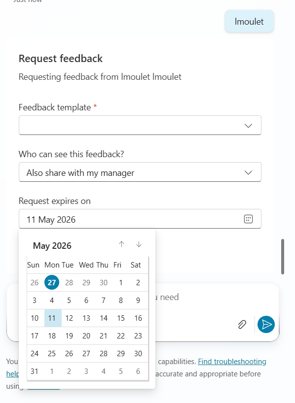

# Workday Extended Topics

These topics extend the base ESS agent with additional Workday scenarios. They use the Workday REST API via the WorkdayRESTExecution flow and WorkdaySystemGetRESTExecution system topic included in the base solution. Add only the topics relevant to your organization and also ensure that the OAuth Client in Workday has needed scopes to access the data.

| File | Who uses it | What it does |
| --- | --- | --- |
| `GetInboxTasks.yaml` | All employees | Shows open Workday inbox tasks |
| `GetPaySlips.yaml` | All employees | Shows recent pay slips with pay date, gross, net, and status |
| `RequestFeedback.yaml` | All employees | Requests feedback from a coworker |
| `TransferEmployee.yaml` | Managers | Transfers a direct report to a new manager |

## Before you start

The following are included in the **EssITWorkdayHCM** and **EssHRWorkdayHCM** base solutions. Confirm they are active before adding any topic here.

1. In Copilot Studio, go to **Topics** and confirm **WorkdaySystemGetRESTExecution** is present and turned on. Every topic here calls it to reach the Workday REST API.

2. `WorkdaySystemGetRESTExecution` invokes the **WorkdayRESTExecution** flow internally. Open that flow on its Power Automate page and confirm its status is **On**. If it is off, turn it on. You may be asked to authorize the Workday connection.

3. **`TransferEmployee.yaml` only** — it also calls **WorkdayManagerCheck** as its first action (to confirm the caller is a manager). Confirm that topic is present and turned on before adding `TransferEmployee.yaml`.

If any of these is missing, import the latest EssITWorkdayHCM or EssHRWorkdayHCM solution first.

## Namespace check

Each topic references other topics by their full namespace in the `dialog:` field. **These samples ship using the base namespace `msdyn_copilotforemployeeselfservice.topic.`** — for example:

```yaml
dialog: msdyn_copilotforemployeeselfservice.topic.WorkdaySystemGetRESTExecution
```

One exception: `TransferEmployee.yaml` references the manager-check topic on the HR namespace (`msdyn_copilotforemployeeselfservicehr.topic.WorkdayManagerCheck`).

If your deployed solution uses a suffixed namespace, update every `dialog:` reference in the code editor to match before publishing:

**EssITWorkdayHCM** — references should use `msdyn_copilotforemployeeselfserviceit.topic.`

**EssHRWorkdayHCM** — references should use `msdyn_copilotforemployeeselfservicehr.topic.`

After saving a topic, verify in the code editor that all `dialog:` references resolve against your solution's namespace. If any reference does not resolve, update it manually before publishing.

## How to add a topic

Copilot Studio does not support file upload for topics. Add each one using the code editor:

1. Open your ESS agent in Copilot Studio.
2. Go to **Topics** and click **Add a topic** then **From blank**.
3. Give the topic a name (see the suggested names in the table below).
4. Click the **...** menu on the topic and select **Open code editor**.
5. Select all the existing content, paste in the contents of the `.yaml` file, and save.
6. Repeat for any other topics you want to add.
7. Publish the agent when done.

Suggested topic names to use in step 3:

| File | Suggested topic name |
| --- | --- |
| `GetInboxTasks.yaml` | Get Employee Inbox Tasks |
| `GetPaySlips.yaml` | Get Pay Slips |
| `RequestFeedback.yaml` | Request Feedback on Worker |
| `TransferEmployee.yaml` | Transfer Employee |

## Configuration

Most topics work without any changes after pasting. The exception is `TransferEmployee.yaml`.

**TransferEmployee.yaml** has one optional setting near the top of the file:

```yaml
- kind: SetVariable
  id: set_reason_id
  variable: Topic.TransferReasonId
  value: ""
```

If your Workday tenant requires a job change reason for transfers, replace `""` with your tenant's transfer reason ID (for example `"JOB_CHANGE_REASON-6-5"`). Find this in Workday under **Maintain Job Change Reasons**. If your tenant does not require it, leave the value as `""`.

**RequestFeedback.yaml** requires at least one feedback template to be configured in your Workday tenant. The template list is fetched dynamically at runtime. No changes to the topic file are needed once templates are set up in Workday.

## Adjustable limits

Both `GetInboxTasks.yaml` and `GetPaySlips.yaml` have a variable at the top that controls how many records are fetched (passed straight to the Workday API's `limit`). Change the value in the code editor after pasting if needed. The maximum below reflects the largest `limit` the Workday REST API accepts per call.

| Topic | Variable | Default | Maximum |
| --- | --- | --- | --- |
| GetInboxTasks | `Topic.MaxTasks` | 20 | 100 |
| GetPaySlips | `Topic.MaxSlips` | 10 | 100 |

## Other customization points

These are optional edits made in the code editor after pasting a topic. None are required for the topic to run.

**Employee identity (all topics).** Every topic identifies the signed-in user through the global variable `Global.ESS_UserContext_Employee_Id`, which the base ESS solution populates at conversation start. The worker ID is sent to Workday as `Employee_ID=<value>`. If your environment sources the employee ID differently, update the `parameters` binding on the relevant `BeginDialog` node, for example:

```yaml
parameters: ="{""workerID"":""Employee_ID=" & Global.ESS_UserContext_Employee_Id & """,""limit"":" & Topic.MaxSlips & ",""offset"":0}"
```

**RequestFeedback.yaml — expiration window.** The request defaults to expiring 14 days out. Change the day count in the `expirationDate` input to adjust:

```yaml
value: Text(DateAdd(Today(), 14, TimeUnit.Days), "yyyy-MM-dd")
```

**RequestFeedback.yaml — sharing options.** The card offers "Share with me only" and "Also share with my manager". Choosing the manager option sets `feedbackConfidential = true` (so the responder's identity stays private from the subject while the manager can see it). Edit the choice labels or the `set_confidential` mapping if your tenant models feedback visibility differently.

**TransferEmployee.yaml — effective date and team move.** The effective date defaults to today (`Text(Today(), "yyyy-MM-dd")`); the manager can change it in the card. The submit binding sends `moveManagersTeam: false`, so only the selected employee moves. Set it to `true` if you want the whole team to move with the manager.

## Previews

**Get Inbox Tasks**


**Request Feedback**



**Transfer Employee**


**Get Pay Slips**

